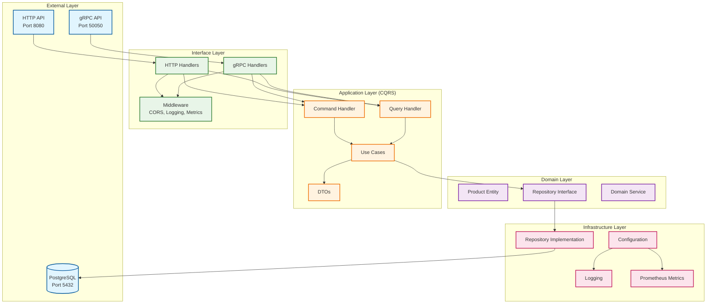
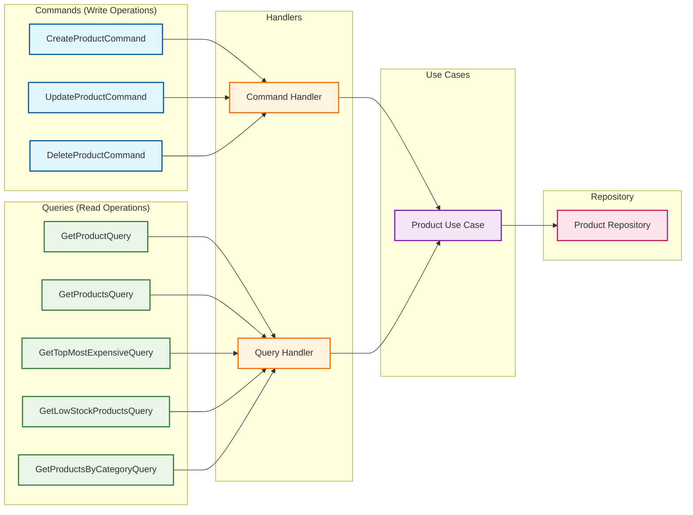
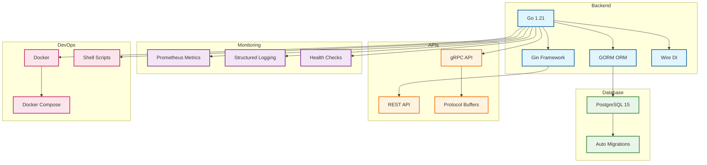
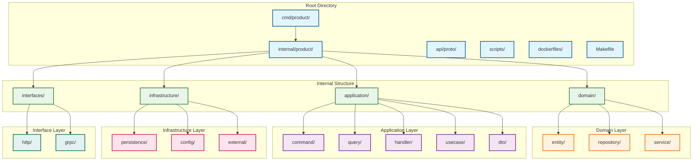
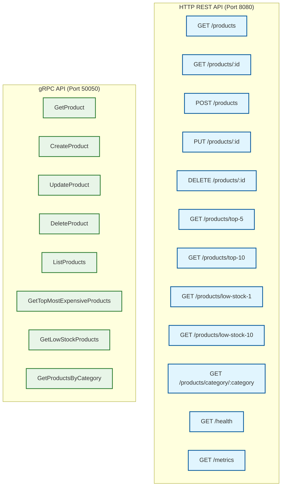
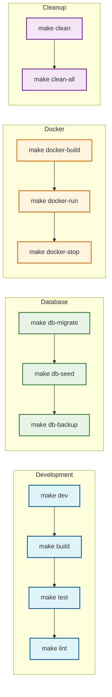
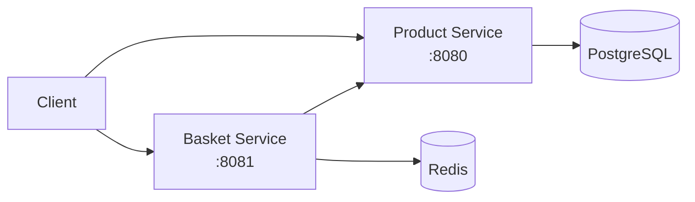

# Microservices Architecture

A modern microservices architecture built with Go, implementing Domain-Driven Design (DDD), CQRS pattern, and Dependency Injection using Wire. This project consists of Product Service and Basket Service with comprehensive management capabilities.

## Services Overview

### 🛍️ Product Service
Comprehensive product management with HTTP REST API and gRPC interfaces.

### 🛒 Basket Service  
Shopping basket management with Redis storage and gRPC product client integration.

## Architecture Overview



## CQRS Pattern Implementation



## Technology Stack



## Project Structure



## API Endpoints



## Development Workflow



## 🛒 Basket Service

### Features
- **Redis Storage**: Fast in-memory storage with automatic TTL (1 day expiration)
- **gRPC Product Client**: Communicates with Product Service for product information
- **CQRS Pattern**: Command and Query separation for better performance
- **Simple Monitoring**: HTTP endpoint monitoring with Prometheus metrics
- **Auto Cleanup**: Redis TTL handles basket expiration automatically

### API Endpoints

| Method | Endpoint | Description |
|--------|----------|-------------|
| GET | `/baskets/{user_id}` | Get user's basket |
| POST | `/baskets` | Create new basket |
| POST | `/baskets/{user_id}/items` | Add item to basket |
| PUT | `/baskets/{user_id}/items/{product_id}` | Update item quantity |
| DELETE | `/baskets/{user_id}/items/{product_id}` | Remove item from basket |
| DELETE | `/baskets/{user_id}/items` | Clear all items |
| DELETE | `/baskets/{user_id}` | Delete entire basket |
| GET | `/health` | Health check |

### Environment Variables

```bash
# Service Configuration
PORT=8081
ENVIRONMENT=development

# Redis Configuration
REDIS_HOST=localhost
REDIS_PORT=6379
REDIS_PASSWORD=
REDIS_DB=0

# Product Service Configuration
PRODUCT_SERVICE_URL=localhost:50050

# Logging Configuration
LOG_LEVEL=debug
LOG_FORMAT=text
LOG_OUTPUT=console
```

### Running Basket Service

```bash
# Build and run
go build -o bin/basket-service cmd/basket/main.go
./bin/basket-service

# Or with Docker Compose (includes Redis)
docker-compose up basket-service
```

### Example Usage

```bash
# Create a basket
curl -X POST http://localhost:8081/baskets \
  -H "Content-Type: application/json" \
  -d '{"user_id": "user123"}'

# Add item to basket
curl -X POST http://localhost:8081/baskets/user123/items \
  -H "Content-Type: application/json" \
  -d '{"product_id": 1, "quantity": 2}'

# Get basket
curl http://localhost:8081/baskets/user123

# Clear basket
curl -X DELETE http://localhost:8081/baskets/user123/items
```

## 🏗️ Development Workflow

### Prerequisites
- Go 1.21+
- Docker & Docker Compose
- PostgreSQL (for Product Service)
- Redis (for Basket Service)

### Quick Start

```bash
# Clone and setup
git clone <repository>
cd obs-tools-usage

# Start all services
docker-compose up -d

# Or start individual services
docker-compose up product-service
docker-compose up basket-service
```

### Service Communication


