# Microservices Architecture

## System Overview

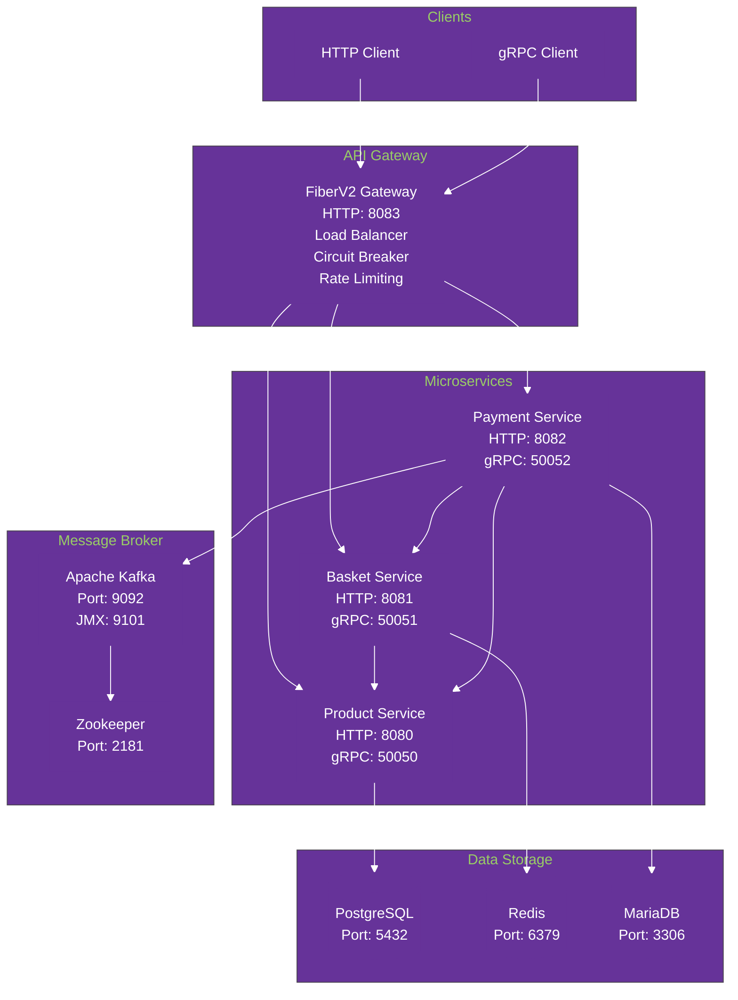

## FiberV2 Gateway Architecture

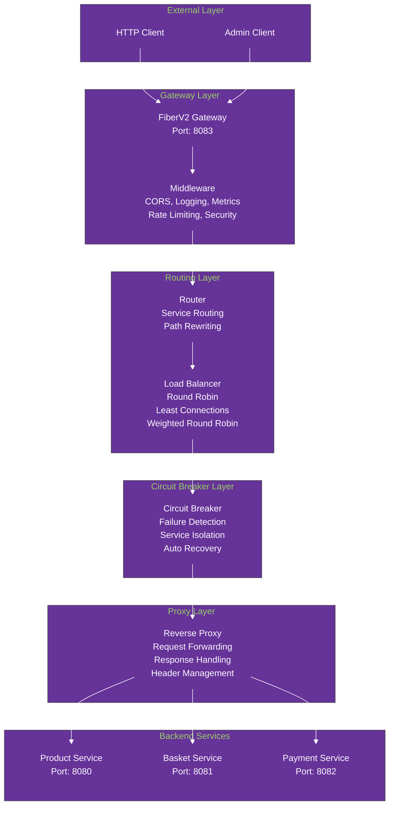

## FiberV2 Gateway Features

```mermaid
%%{init: {'theme':'base', 'themeVariables': { 'primaryColor': '#663399', 'primaryTextColor': '#ffffff', 'primaryBorderColor': '#663399', 'lineColor': '#ffffff', 'secondaryColor': '#663399', 'tertiaryColor': '#663399'}}}%%
graph TB
    subgraph "Core Features"
        ReverseProxy[Reverse Proxy<br/>Request Forwarding<br/>Response Handling]
        LoadBalancing[Load Balancing<br/>Round Robin<br/>Least Connections<br/>Weighted Round Robin]
        CircuitBreaker[Circuit Breaker<br/>Failure Detection<br/>Service Isolation<br/>Auto Recovery]
    end
    
    subgraph "Security Features"
        RateLimiting[Rate Limiting<br/>Request Throttling<br/>Burst Control]
        CORSSupport[CORS Support<br/>Cross-Origin Requests<br/>Header Management]
        SecurityHeaders[Security Headers<br/>XSS Protection<br/>CSRF Protection<br/>HSTS]
    end
    
    subgraph "Monitoring Features"
        HealthChecks[Health Checks<br/>Service Monitoring<br/>Status Reporting]
        Metrics[Prometheus Metrics<br/>Request Counters<br/>Response Times<br/>Error Rates]
        Logging[Structured Logging<br/>Request Tracking<br/>Error Logging]
    end
    
    subgraph "Admin Features"
        AdminAPI[Admin API<br/>Service Management<br/>Configuration Updates]
        StatusMonitoring[Status Monitoring<br/>Real-time Health<br/>Performance Metrics]
        ServiceDiscovery[Service Discovery<br/>Dynamic Backend<br/>Configuration]
    end
    
    ReverseProxy --> LoadBalancing
    LoadBalancing --> CircuitBreaker
    CircuitBreaker --> RateLimiting
    RateLimiting --> CORSSupport
    CORSSupport --> SecurityHeaders
    SecurityHeaders --> HealthChecks
    HealthChecks --> Metrics
    Metrics --> Logging
    Logging --> AdminAPI
    AdminAPI --> StatusMonitoring
    StatusMonitoring --> ServiceDiscovery
```

## FiberV2 Gateway API Endpoints

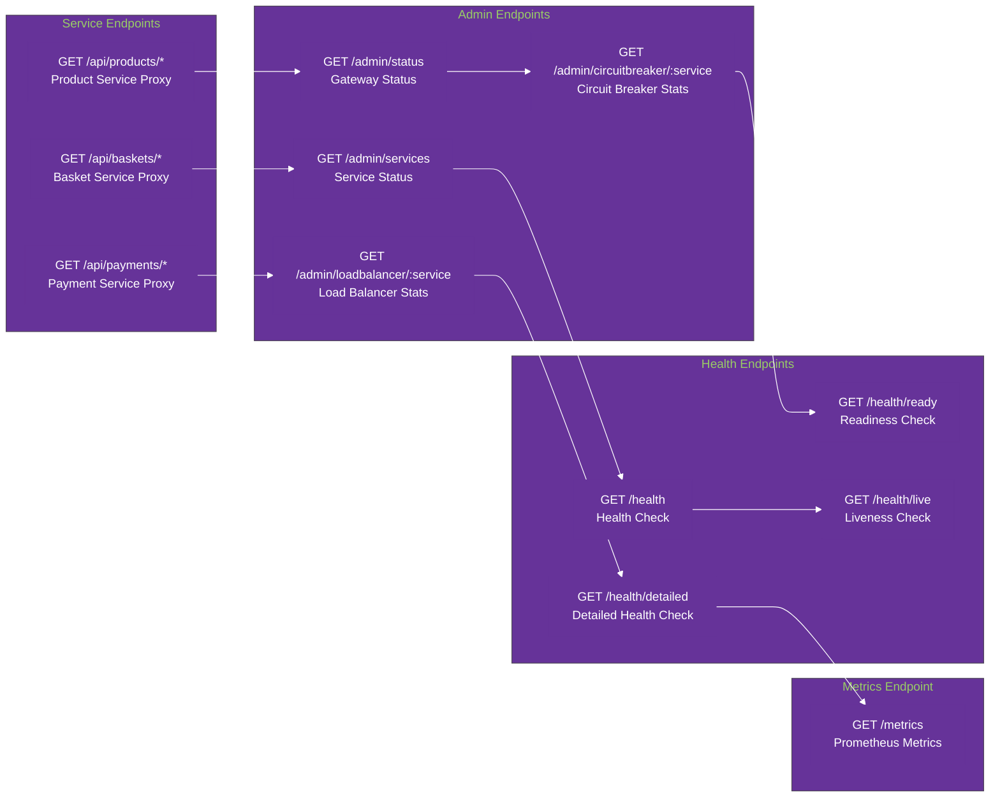

## FiberV2 Gateway Environment Variables

```mermaid
%%{init: {'theme':'base', 'themeVariables': { 'primaryColor': '#663399', 'primaryTextColor': '#ffffff', 'primaryBorderColor': '#663399', 'lineColor': '#ffffff', 'secondaryColor': '#663399', 'tertiaryColor': '#663399'}}}%%
graph TB
    subgraph "Server Configuration"
        PORT[PORT: 8080]
        LOG_LEVEL[LOG_LEVEL: info]
        LOG_FORMAT[LOG_FORMAT: json]
    end
    
    subgraph "Service Configuration"
        PRODUCT_ENABLED[PRODUCT_SERVICE_ENABLED: true]
        PRODUCT_URLS[PRODUCT_SERVICE_URLS: http://product-service:8080]
        BASKET_ENABLED[BASKET_SERVICE_ENABLED: true]
        BASKET_URLS[BASKET_SERVICE_URLS: http://basket-service:8081]
        PAYMENT_ENABLED[PAYMENT_SERVICE_ENABLED: true]
        PAYMENT_URLS[PAYMENT_SERVICE_URLS: http://payment-service:8082]
    end
    
    subgraph "Circuit Breaker Configuration"
        CB_ENABLED[CIRCUIT_BREAKER_ENABLED: true]
        CB_MAX_REQUESTS[CIRCUIT_BREAKER_MAX_REQUESTS: 10]
        CB_INTERVAL[CIRCUIT_BREAKER_INTERVAL: 60]
        CB_TIMEOUT[CIRCUIT_BREAKER_TIMEOUT: 30]
    end
    
    subgraph "Load Balancer Configuration"
        LB_ENABLED[LOAD_BALANCER_ENABLED: true]
        LB_STRATEGY[LOAD_BALANCER_STRATEGY: round_robin]
    end
    
    subgraph "Rate Limiting Configuration"
        RL_ENABLED[RATE_LIMIT_ENABLED: true]
        RL_REQUESTS[RATE_LIMIT_REQUESTS: 100]
        RL_WINDOW[RATE_LIMIT_WINDOW: 1m]
        RL_BURST[RATE_LIMIT_BURST: 10]
    end
    
    PORT --> LOG_LEVEL
    LOG_LEVEL --> LOG_FORMAT
    LOG_FORMAT --> PRODUCT_ENABLED
    PRODUCT_ENABLED --> PRODUCT_URLS
    PRODUCT_URLS --> BASKET_ENABLED
    BASKET_ENABLED --> BASKET_URLS
    BASKET_URLS --> PAYMENT_ENABLED
    PAYMENT_ENABLED --> PAYMENT_URLS
    PAYMENT_URLS --> CB_ENABLED
    CB_ENABLED --> CB_MAX_REQUESTS
    CB_MAX_REQUESTS --> CB_INTERVAL
    CB_INTERVAL --> CB_TIMEOUT
    CB_TIMEOUT --> LB_ENABLED
    LB_ENABLED --> LB_STRATEGY
    LB_STRATEGY --> RL_ENABLED
    RL_ENABLED --> RL_REQUESTS
    RL_REQUESTS --> RL_WINDOW
    RL_WINDOW --> RL_BURST
```

## Product Service Architecture

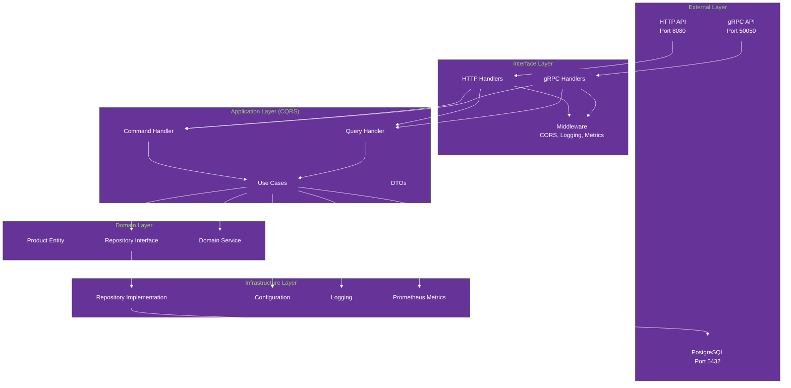

## Product Service API Endpoints

```mermaid
%%{init: {'theme':'base', 'themeVariables': { 'primaryColor': '#663399', 'primaryTextColor': '#ffffff', 'primaryBorderColor': '#663399', 'lineColor': '#ffffff', 'secondaryColor': '#663399', 'tertiaryColor': '#663399'}}}%%
graph LR
    subgraph "HTTP Endpoints"
        GET1[GET /products<br/>Get all products]
        GET2[GET /products/{id}<br/>Get product by ID]
        POST[POST /products<br/>Create new product]
        PUT[PUT /products/{id}<br/>Update product]
        DELETE[DELETE /products/{id}<br/>Delete product]
        HEALTH[GET /health<br/>Health check]
    end
    
    subgraph "gRPC Methods"
        CreateProduct[CreateProduct]
        GetProduct[GetProduct]
        GetProducts[GetProducts]
        UpdateProduct[UpdateProduct]
        DeleteProduct[DeleteProduct]
    end
```

## Product Service Environment Variables

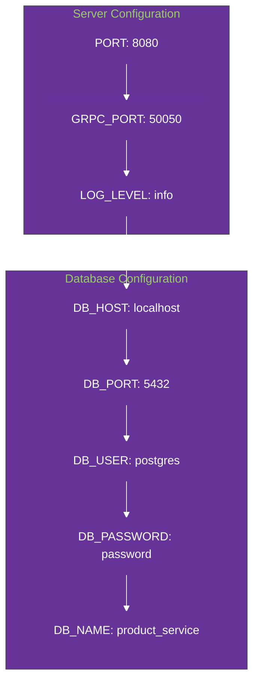

## Basket Service Architecture

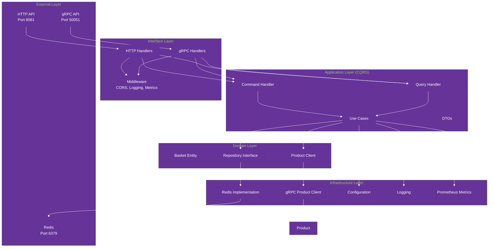

## Basket Service API Endpoints

```mermaid
%%{init: {'theme':'base', 'themeVariables': { 'primaryColor': '#663399', 'primaryTextColor': '#ffffff', 'primaryBorderColor': '#663399', 'lineColor': '#ffffff', 'secondaryColor': '#663399', 'tertiaryColor': '#663399'}}}%%
graph LR
    subgraph "Basket Management"
        GET_BASKET[GET /baskets/{user_id}<br/>Get user basket]
        CREATE_BASKET[POST /baskets<br/>Create new basket]
        DELETE_BASKET[DELETE /baskets/{user_id}<br/>Delete basket]
    end
    
    subgraph "Item Management"
        ADD_ITEM[POST /baskets/{user_id}/items<br/>Add item]
        UPDATE_ITEM[PUT /baskets/{user_id}/items/{product_id}<br/>Update quantity]
        REMOVE_ITEM[DELETE /baskets/{user_id}/items/{product_id}<br/>Remove item]
        CLEAR_ITEMS[DELETE /baskets/{user_id}/items<br/>Clear all items]
    end
    
    subgraph "Health Check"
        HEALTH[GET /health<br/>Health check]
    end
    
    GET_BASKET --> ADD_ITEM
    ADD_ITEM --> UPDATE_ITEM
    UPDATE_ITEM --> REMOVE_ITEM
    REMOVE_ITEM --> CLEAR_ITEMS
    CLEAR_ITEMS --> HEALTH
```

## Basket Service Environment Variables

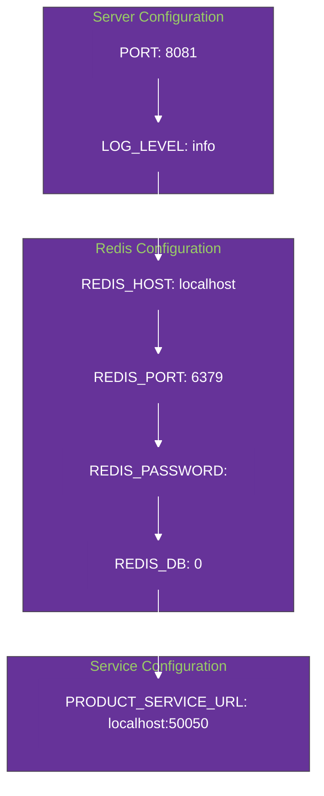

## Payment Service Architecture

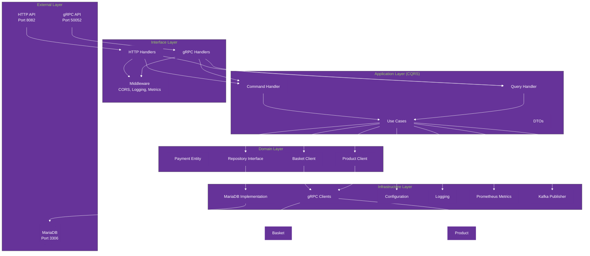

## Payment Service API Endpoints

```mermaid
%%{init: {'theme':'base', 'themeVariables': { 'primaryColor': '#663399', 'primaryTextColor': '#ffffff', 'primaryBorderColor': '#663399', 'lineColor': '#ffffff', 'secondaryColor': '#663399', 'tertiaryColor': '#663399'}}}%%
graph LR
    subgraph "Payment Management"
        CREATE_PAYMENT[POST /payments<br/>Create payment]
        GET_PAYMENT[GET /payments/{id}<br/>Get payment]
        PROCESS_PAYMENT[POST /payments/{id}/process<br/>Process payment]
        CANCEL_PAYMENT[POST /payments/{id}/cancel<br/>Cancel payment]
        REFUND_PAYMENT[POST /payments/{id}/refund<br/>Refund payment]
    end
    
    subgraph "Payment History"
        GET_PAYMENTS[GET /payments<br/>Get all payments]
        GET_USER_PAYMENTS[GET /users/{user_id}/payments<br/>Get user payments]
    end
    
    subgraph "Health Check"
        HEALTH[GET /health<br/>Health check]
    end
    
    CREATE_PAYMENT --> GET_PAYMENT
    GET_PAYMENT --> PROCESS_PAYMENT
    PROCESS_PAYMENT --> CANCEL_PAYMENT
    CANCEL_PAYMENT --> REFUND_PAYMENT
    REFUND_PAYMENT --> GET_PAYMENTS
    GET_PAYMENTS --> GET_USER_PAYMENTS
    GET_USER_PAYMENTS --> HEALTH
```

## Payment Service Environment Variables

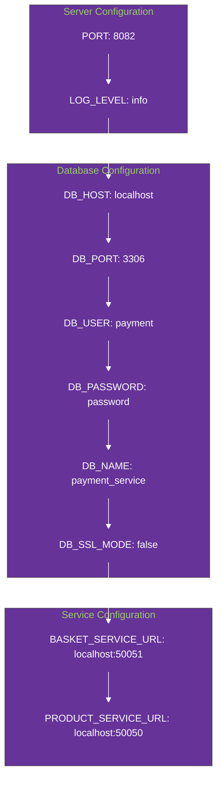

## Event-Driven Architecture with Kafka

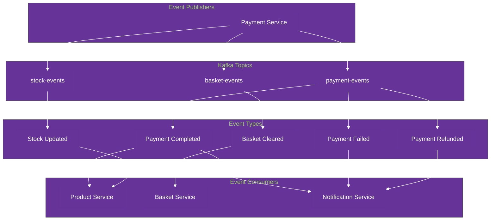

## Docker Services Configuration

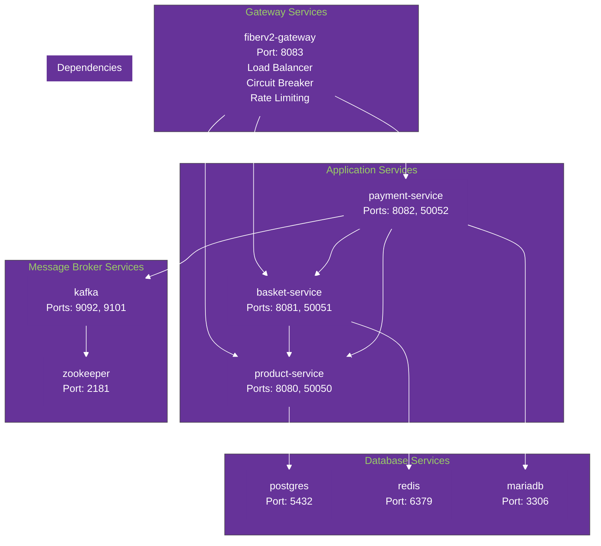

## Technology Stack

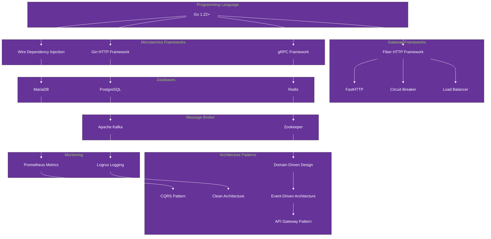

## Development Workflow

```mermaid
%%{init: {'theme':'base', 'themeVariables': { 'primaryColor': '#663399', 'primaryTextColor': '#ffffff', 'primaryBorderColor': '#663399', 'lineColor': '#ffffff', 'secondaryColor': '#663399', 'tertiaryColor': '#663399'}}}%%
graph LR
    subgraph "Setup Phase"
        Setup[make setup]
        InstallDeps[make install-deps]
        Proto[make proto]
    end
    
    subgraph "Development Phase"
        Dev[make dev]
        Build[make build]
        Test[make test]
        Lint[make lint]
    end
    
    subgraph "Deployment Phase"
        DockerBuild[make docker-build]
        DockerRun[make docker-run]
        ServicesStart[make services-start]
    end
    
    subgraph "Maintenance Phase"
        ServicesStop[make services-stop]
        ServicesRestart[make services-restart]
        Clean[make clean]
    end
    
    Setup --> InstallDeps
    InstallDeps --> Proto
    Proto --> Dev
    Dev --> Build
    Build --> Test
    Test --> Lint
    Lint --> DockerBuild
    DockerBuild --> DockerRun
    DockerRun --> ServicesStart
    ServicesStart --> ServicesStop
    ServicesStop --> ServicesRestart
    ServicesRestart --> Clean
```

## Database Schema Overview

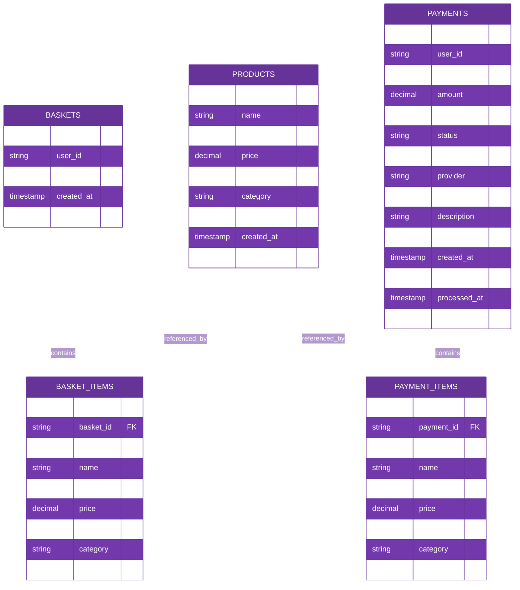

## API Request Flow

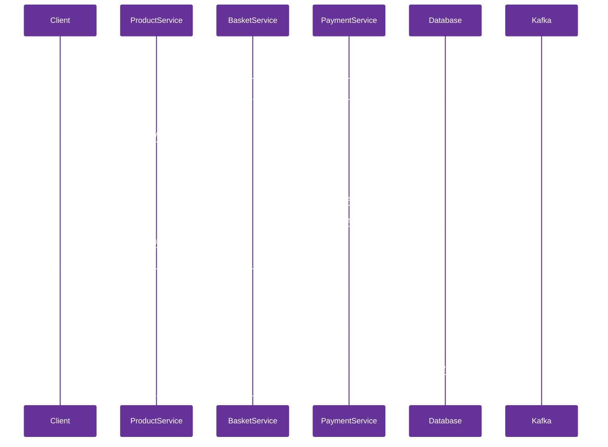

## Service Communication Flow

```mermaid
%%{init: {'theme':'base', 'themeVariables': { 'primaryColor': '#663399', 'primaryTextColor': '#ffffff', 'primaryBorderColor': '#663399', 'lineColor': '#ffffff', 'secondaryColor': '#663399', 'tertiaryColor': '#663399'}}}%%
graph TB
    subgraph "Client Layer"
        WebClient[Web Client]
        MobileClient[Mobile Client]
        APIClient[API Client]
    end
    
    subgraph "API Gateway Layer"
        FiberGateway[FiberV2 Gateway<br/>Port: 8083]
        LoadBalancer[Load Balancer<br/>Round Robin<br/>Least Connections]
        CircuitBreaker[Circuit Breaker<br/>Failure Detection<br/>Service Isolation]
        RateLimiter[Rate Limiter<br/>Request Throttling<br/>Burst Control]
        ReverseProxy[Reverse Proxy<br/>Request Forwarding<br/>Response Handling]
    end
    
    subgraph "Microservices Layer"
        ProductService[Product Service<br/>Port: 8080]
        BasketService[Basket Service<br/>Port: 8081]
        PaymentService[Payment Service<br/>Port: 8082]
    end
    
    subgraph "Data Layer"
        PostgreSQL[(PostgreSQL<br/>Port: 5432)]
        Redis[(Redis<br/>Port: 6379)]
        MariaDB[(MariaDB<br/>Port: 3306)]
    end
    
    subgraph "Message Layer"
        Kafka[Apache Kafka<br/>Port: 9092]
        Zookeeper[Zookeeper<br/>Port: 2181]
    end
    
    WebClient --> FiberGateway
    MobileClient --> FiberGateway
    APIClient --> FiberGateway
    
    FiberGateway --> LoadBalancer
    LoadBalancer --> CircuitBreaker
    CircuitBreaker --> RateLimiter
    RateLimiter --> ReverseProxy
    
    ReverseProxy --> ProductService
    ReverseProxy --> BasketService
    ReverseProxy --> PaymentService
    
    ProductService --> PostgreSQL
    BasketService --> Redis
    PaymentService --> MariaDB
    
    PaymentService --> Kafka
    Kafka --> Zookeeper
    
    BasketService --> ProductService
    PaymentService --> BasketService
    PaymentService --> ProductService
```

## Kubernetes Deployment Architecture

```mermaid
%%{init: {'theme':'base', 'themeVariables': { 'primaryColor': '#663399', 'primaryTextColor': '#ffffff', 'primaryBorderColor': '#663399', 'lineColor': '#ffffff', 'secondaryColor': '#663399', 'tertiaryColor': '#663399'}}}%%
graph TB
    subgraph "Kubernetes Cluster"
        subgraph "Ingress Layer"
            Ingress[Ingress Controller<br/>nginx-ingress<br/>SSL Termination<br/>Load Balancing]
        end
        
        subgraph "Application Layer"
            Gateway[Gateway Deployment<br/>3 Replicas<br/>LoadBalancer Service]
            ProductService[Product Service<br/>2 Replicas<br/>ClusterIP Service]
            BasketService[Basket Service<br/>2 Replicas<br/>ClusterIP Service]
            PaymentService[Payment Service<br/>2 Replicas<br/>ClusterIP Service]
        end
        
        subgraph "Data Layer"
            PostgreSQL[PostgreSQL<br/>Bitnami Chart<br/>8Gi Persistent Volume]
            Redis[Redis<br/>Bitnami Chart<br/>4Gi Persistent Volume]
            MariaDB[MariaDB<br/>Bitnami Chart<br/>8Gi Persistent Volume]
        end
        
        subgraph "Message Layer"
            Kafka[Kafka<br/>Bitnami Chart<br/>3 Replicas<br/>10Gi Persistent Volume]
            Zookeeper[Zookeeper<br/>Bitnami Chart<br/>3 Replicas]
        end
        
        subgraph "Monitoring Layer"
            ServiceMonitor[ServiceMonitor<br/>Prometheus Integration]
            HPA[Horizontal Pod Autoscaler<br/>CPU/Memory Based Scaling]
        end
        
        subgraph "Security Layer"
            NetworkPolicy[NetworkPolicy<br/>Traffic Isolation]
            ServiceAccount[ServiceAccount<br/>RBAC Integration]
            PodSecurityContext[Pod Security Context<br/>Non-root User<br/>Read-only Filesystem]
        end
    end
    
    subgraph "External Access"
        Client[External Client]
        LoadBalancer[Load Balancer<br/>AWS NLB / GCP LB]
    end
    
    Client --> LoadBalancer
    LoadBalancer --> Ingress
    Ingress --> Gateway
    
    Gateway --> ProductService
    Gateway --> BasketService
    Gateway --> PaymentService
    
    ProductService --> PostgreSQL
    BasketService --> Redis
    PaymentService --> MariaDB
    
    PaymentService --> Kafka
    Kafka --> Zookeeper
    
    BasketService --> ProductService
    PaymentService --> BasketService
    PaymentService --> ProductService
    
    Gateway --> ServiceMonitor
    Gateway --> HPA
    
    Gateway --> NetworkPolicy
    ProductService --> NetworkPolicy
    BasketService --> NetworkPolicy
    PaymentService --> NetworkPolicy
    
    Gateway --> ServiceAccount
    ProductService --> ServiceAccount
    BasketService --> ServiceAccount
    PaymentService --> ServiceAccount
```

## Helm Chart Structure

```mermaid
%%{init: {'theme':'base', 'themeVariables': { 'primaryColor': '#663399', 'primaryTextColor': '#ffffff', 'primaryBorderColor': '#663399', 'lineColor': '#ffffff', 'secondaryColor': '#663399', 'tertiaryColor': '#663399'}}}%%
graph TB
    subgraph "Helm Chart"
        ChartYaml[Chart.yaml<br/>Metadata & Dependencies]
        ValuesYaml[values.yaml<br/>Configuration Values]
        
        subgraph "Templates"
            Deployments[Deployments<br/>product-service<br/>basket-service<br/>payment-service<br/>gateway]
            Services[Services<br/>ClusterIP Services<br/>LoadBalancer Service]
            ConfigMaps[ConfigMaps<br/>Service Configurations]
            Ingress[Ingress<br/>External Access]
            ServiceAccount[ServiceAccount<br/>RBAC]
            NetworkPolicy[NetworkPolicy<br/>Security]
            ServiceMonitor[ServiceMonitor<br/>Monitoring]
            HPA[HPA<br/>Autoscaling]
        end
        
        subgraph "Dependencies"
            PostgreSQLChart[PostgreSQL Chart<br/>Bitnami]
            RedisChart[Redis Chart<br/>Bitnami]
            MariaDBChart[MariaDB Chart<br/>Bitnami]
            KafkaChart[Kafka Chart<br/>Bitnami]
        end
    end
    
    ChartYaml --> Deployments
    ValuesYaml --> Deployments
    
    Deployments --> Services
    Services --> ConfigMaps
    ConfigMaps --> Ingress
    Ingress --> ServiceAccount
    ServiceAccount --> NetworkPolicy
    NetworkPolicy --> ServiceMonitor
    ServiceMonitor --> HPA
    
    ChartYaml --> PostgreSQLChart
    ChartYaml --> RedisChart
    ChartYaml --> MariaDBChart
    ChartYaml --> KafkaChart
```

## Deployment Commands

```bash
# Install the Helm chart
helm install obs-tools-usage ./helm

# Upgrade the deployment
helm upgrade obs-tools-usage ./helm

# Check deployment status
helm status obs-tools-usage

# View all resources
kubectl get all -l app.kubernetes.io/name=obs-tools-usage

# Access the gateway
kubectl port-forward svc/obs-tools-usage-gateway 8080:8080

# View logs
kubectl logs -l app.kubernetes.io/component=gateway -f

# Scale services
kubectl scale deployment obs-tools-usage-gateway --replicas=5
```

## Environment Configuration

```mermaid
%%{init: {'theme':'base', 'themeVariables': { 'primaryColor': '#663399', 'primaryTextColor': '#ffffff', 'primaryBorderColor': '#663399', 'lineColor': '#ffffff', 'secondaryColor': '#663399', 'tertiaryColor': '#663399'}}}%%
graph TB
    subgraph "Production Environment"
        ProdValues[values.yaml<br/>Production Settings]
        ProdSecurity[Security Context<br/>Non-root User<br/>Read-only Filesystem]
        ProdResources[Resource Limits<br/>CPU: 1000m<br/>Memory: 1Gi]
        ProdPersistence[Persistent Volumes<br/>8Gi PostgreSQL<br/>4Gi Redis<br/>8Gi MariaDB<br/>10Gi Kafka]
    end
    
    subgraph "Development Environment"
        DevValues[values-dev.yaml<br/>Development Settings]
        DevSecurity[Relaxed Security<br/>Debug Mode]
        DevResources[Lower Resources<br/>CPU: 250m<br/>Memory: 256Mi]
        DevPersistence[Smaller Volumes<br/>1Gi each]
    end
    
    subgraph "Staging Environment"
        StagingValues[values-staging.yaml<br/>Staging Settings]
        StagingSecurity[Production-like Security]
        StagingResources[Medium Resources<br/>CPU: 500m<br/>Memory: 512Mi]
        StagingPersistence[Medium Volumes<br/>4Gi each]
    end
```

## Monitoring and Observability

```mermaid
%%{init: {'theme':'base', 'themeVariables': { 'primaryColor': '#663399', 'primaryTextColor': '#ffffff', 'primaryBorderColor': '#663399', 'lineColor': '#ffffff', 'secondaryColor': '#663399', 'tertiaryColor': '#663399'}}}%%
graph TB
    subgraph "Application Metrics"
        PrometheusMetrics[Prometheus Metrics<br/>Request Count<br/>Response Time<br/>Error Rate<br/>CPU Usage<br/>Memory Usage]
    end
    
    subgraph "Health Checks"
        LivenessProbe[Liveness Probe<br/>/health endpoint<br/>30s interval]
        ReadinessProbe[Readiness Probe<br/>/health/ready endpoint<br/>5s interval]
    end
    
    subgraph "Logging"
        StructuredLogs[Structured Logging<br/>JSON Format<br/>Request Tracking<br/>Error Logging]
    end
    
    subgraph "Service Discovery"
        ServiceMonitor[ServiceMonitor<br/>Prometheus Integration<br/>30s scrape interval]
    end
    
    subgraph "Autoscaling"
        HPA[HPA<br/>CPU-based Scaling<br/>Memory-based Scaling<br/>Min: 1, Max: 100]
    end
    
    PrometheusMetrics --> LivenessProbe
    LivenessProbe --> ReadinessProbe
    ReadinessProbe --> StructuredLogs
    StructuredLogs --> ServiceMonitor
    ServiceMonitor --> HPA
```