# Microservices Architecture

## System Overview

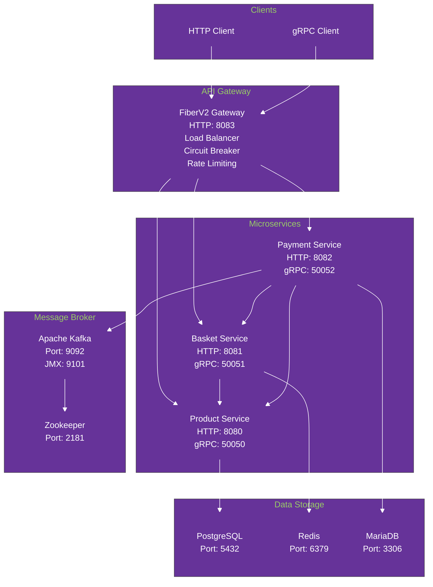

## FiberV2 Gateway Architecture

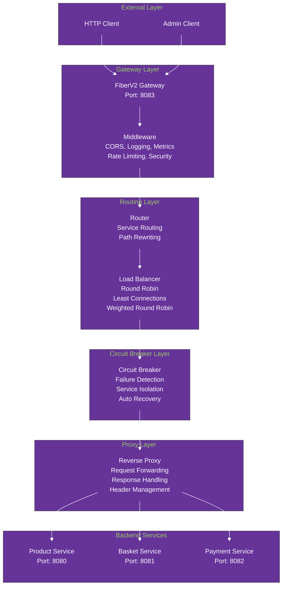

## FiberV2 Gateway Features

```mermaid
%%{init: {'theme':'base', 'themeVariables': { 'primaryColor': '#663399', 'primaryTextColor': '#ffffff', 'primaryBorderColor': '#663399', 'lineColor': '#ffffff', 'secondaryColor': '#663399', 'tertiaryColor': '#663399'}}}%%
graph TB
    subgraph "Core Features"
        ReverseProxy[Reverse Proxy<br/>Request Forwarding<br/>Response Handling]
        LoadBalancing[Load Balancing<br/>Round Robin<br/>Least Connections<br/>Weighted Round Robin]
        CircuitBreaker[Circuit Breaker<br/>Failure Detection<br/>Service Isolation<br/>Auto Recovery]
    end
    
    subgraph "Security Features"
        RateLimiting[Rate Limiting<br/>Request Throttling<br/>Burst Control]
        CORSSupport[CORS Support<br/>Cross-Origin Requests<br/>Header Management]
        SecurityHeaders[Security Headers<br/>XSS Protection<br/>CSRF Protection<br/>HSTS]
    end
    
    subgraph "Monitoring Features"
        HealthChecks[Health Checks<br/>Service Monitoring<br/>Status Reporting]
        Metrics[Prometheus Metrics<br/>Request Counters<br/>Response Times<br/>Error Rates]
        Logging[Structured Logging<br/>Request Tracking<br/>Error Logging]
    end
    
    subgraph "Admin Features"
        AdminAPI[Admin API<br/>Service Management<br/>Configuration Updates]
        StatusMonitoring[Status Monitoring<br/>Real-time Health<br/>Performance Metrics]
        ServiceDiscovery[Service Discovery<br/>Dynamic Backend<br/>Configuration]
    end
    
    ReverseProxy --> LoadBalancing
    LoadBalancing --> CircuitBreaker
    CircuitBreaker --> RateLimiting
    RateLimiting --> CORSSupport
    CORSSupport --> SecurityHeaders
    SecurityHeaders --> HealthChecks
    HealthChecks --> Metrics
    Metrics --> Logging
    Logging --> AdminAPI
    AdminAPI --> StatusMonitoring
    StatusMonitoring --> ServiceDiscovery
```

## FiberV2 Gateway API Endpoints

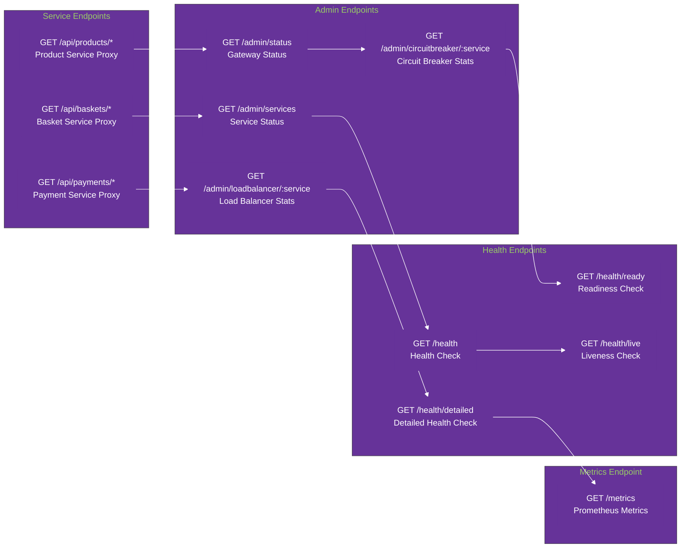

## FiberV2 Gateway Environment Variables

```mermaid
%%{init: {'theme':'base', 'themeVariables': { 'primaryColor': '#663399', 'primaryTextColor': '#ffffff', 'primaryBorderColor': '#663399', 'lineColor': '#ffffff', 'secondaryColor': '#663399', 'tertiaryColor': '#663399'}}}%%
graph TB
    subgraph "Server Configuration"
        PORT[PORT: 8080]
        LOG_LEVEL[LOG_LEVEL: info]
        LOG_FORMAT[LOG_FORMAT: json]
    end
    
    subgraph "Service Configuration"
        PRODUCT_ENABLED[PRODUCT_SERVICE_ENABLED: true]
        PRODUCT_URLS[PRODUCT_SERVICE_URLS: http://product-service:8080]
        BASKET_ENABLED[BASKET_SERVICE_ENABLED: true]
        BASKET_URLS[BASKET_SERVICE_URLS: http://basket-service:8081]
        PAYMENT_ENABLED[PAYMENT_SERVICE_ENABLED: true]
        PAYMENT_URLS[PAYMENT_SERVICE_URLS: http://payment-service:8082]
    end
    
    subgraph "Circuit Breaker Configuration"
        CB_ENABLED[CIRCUIT_BREAKER_ENABLED: true]
        CB_MAX_REQUESTS[CIRCUIT_BREAKER_MAX_REQUESTS: 10]
        CB_INTERVAL[CIRCUIT_BREAKER_INTERVAL: 60]
        CB_TIMEOUT[CIRCUIT_BREAKER_TIMEOUT: 30]
    end
    
    subgraph "Load Balancer Configuration"
        LB_ENABLED[LOAD_BALANCER_ENABLED: true]
        LB_STRATEGY[LOAD_BALANCER_STRATEGY: round_robin]
    end
    
    subgraph "Rate Limiting Configuration"
        RL_ENABLED[RATE_LIMIT_ENABLED: true]
        RL_REQUESTS[RATE_LIMIT_REQUESTS: 100]
        RL_WINDOW[RATE_LIMIT_WINDOW: 1m]
        RL_BURST[RATE_LIMIT_BURST: 10]
    end
    
    PORT --> LOG_LEVEL
    LOG_LEVEL --> LOG_FORMAT
    LOG_FORMAT --> PRODUCT_ENABLED
    PRODUCT_ENABLED --> PRODUCT_URLS
    PRODUCT_URLS --> BASKET_ENABLED
    BASKET_ENABLED --> BASKET_URLS
    BASKET_URLS --> PAYMENT_ENABLED
    PAYMENT_ENABLED --> PAYMENT_URLS
    PAYMENT_URLS --> CB_ENABLED
    CB_ENABLED --> CB_MAX_REQUESTS
    CB_MAX_REQUESTS --> CB_INTERVAL
    CB_INTERVAL --> CB_TIMEOUT
    CB_TIMEOUT --> LB_ENABLED
    LB_ENABLED --> LB_STRATEGY
    LB_STRATEGY --> RL_ENABLED
    RL_ENABLED --> RL_REQUESTS
    RL_REQUESTS --> RL_WINDOW
    RL_WINDOW --> RL_BURST
```

## Product Service Architecture

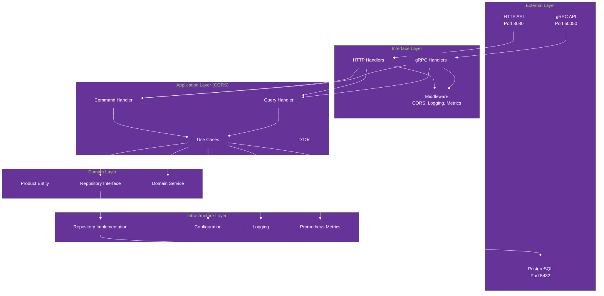

## Product Service API Endpoints

```mermaid
%%{init: {'theme':'base', 'themeVariables': { 'primaryColor': '#663399', 'primaryTextColor': '#ffffff', 'primaryBorderColor': '#663399', 'lineColor': '#ffffff', 'secondaryColor': '#663399', 'tertiaryColor': '#663399'}}}%%
graph LR
    subgraph "HTTP Endpoints"
        GET1[GET /products<br/>Get all products]
        GET2[GET /products/{id}<br/>Get product by ID]
        POST[POST /products<br/>Create new product]
        PUT[PUT /products/{id}<br/>Update product]
        DELETE[DELETE /products/{id}<br/>Delete product]
        HEALTH[GET /health<br/>Health check]
    end
    
    subgraph "gRPC Methods"
        CreateProduct[CreateProduct]
        GetProduct[GetProduct]
        GetProducts[GetProducts]
        UpdateProduct[UpdateProduct]
        DeleteProduct[DeleteProduct]
    end
```

## Product Service Environment Variables

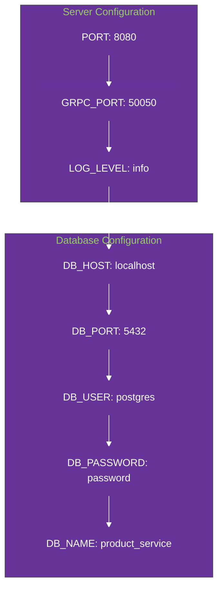

## Basket Service Architecture

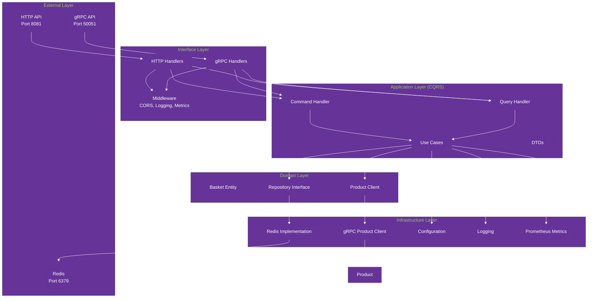

## Basket Service API Endpoints

```mermaid
%%{init: {'theme':'base', 'themeVariables': { 'primaryColor': '#663399', 'primaryTextColor': '#ffffff', 'primaryBorderColor': '#663399', 'lineColor': '#ffffff', 'secondaryColor': '#663399', 'tertiaryColor': '#663399'}}}%%
graph LR
    subgraph "Basket Management"
        GET_BASKET[GET /baskets/{user_id}<br/>Get user basket]
        CREATE_BASKET[POST /baskets<br/>Create new basket]
        DELETE_BASKET[DELETE /baskets/{user_id}<br/>Delete basket]
    end
    
    subgraph "Item Management"
        ADD_ITEM[POST /baskets/{user_id}/items<br/>Add item]
        UPDATE_ITEM[PUT /baskets/{user_id}/items/{product_id}<br/>Update quantity]
        REMOVE_ITEM[DELETE /baskets/{user_id}/items/{product_id}<br/>Remove item]
        CLEAR_ITEMS[DELETE /baskets/{user_id}/items<br/>Clear all items]
    end
    
    subgraph "Health Check"
        HEALTH[GET /health<br/>Health check]
    end
    
    GET_BASKET --> ADD_ITEM
    ADD_ITEM --> UPDATE_ITEM
    UPDATE_ITEM --> REMOVE_ITEM
    REMOVE_ITEM --> CLEAR_ITEMS
    CLEAR_ITEMS --> HEALTH
```

## Basket Service Environment Variables

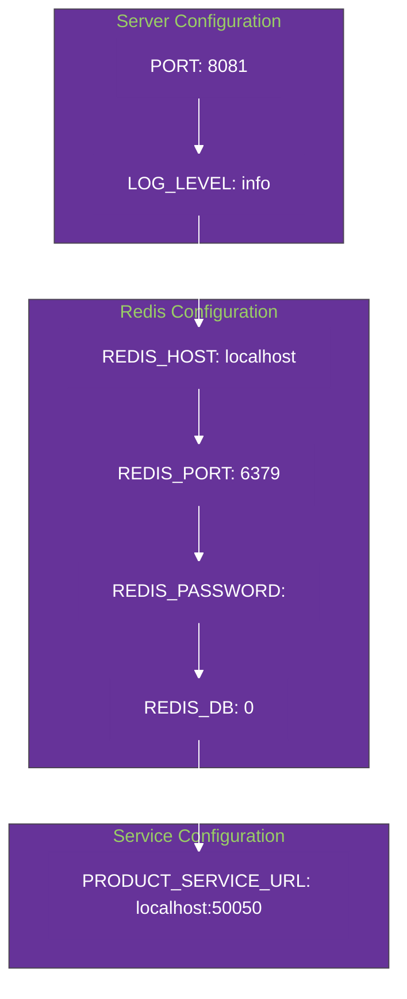

## Payment Service Architecture

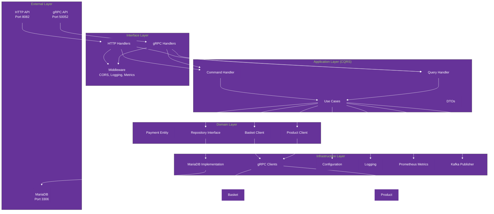

## Payment Service API Endpoints

```mermaid
%%{init: {'theme':'base', 'themeVariables': { 'primaryColor': '#663399', 'primaryTextColor': '#ffffff', 'primaryBorderColor': '#663399', 'lineColor': '#ffffff', 'secondaryColor': '#663399', 'tertiaryColor': '#663399'}}}%%
graph LR
    subgraph "Payment Management"
        CREATE_PAYMENT[POST /payments<br/>Create payment]
        GET_PAYMENT[GET /payments/{id}<br/>Get payment]
        PROCESS_PAYMENT[POST /payments/{id}/process<br/>Process payment]
        CANCEL_PAYMENT[POST /payments/{id}/cancel<br/>Cancel payment]
        REFUND_PAYMENT[POST /payments/{id}/refund<br/>Refund payment]
    end
    
    subgraph "Payment History"
        GET_PAYMENTS[GET /payments<br/>Get all payments]
        GET_USER_PAYMENTS[GET /users/{user_id}/payments<br/>Get user payments]
    end
    
    subgraph "Health Check"
        HEALTH[GET /health<br/>Health check]
    end
    
    CREATE_PAYMENT --> GET_PAYMENT
    GET_PAYMENT --> PROCESS_PAYMENT
    PROCESS_PAYMENT --> CANCEL_PAYMENT
    CANCEL_PAYMENT --> REFUND_PAYMENT
    REFUND_PAYMENT --> GET_PAYMENTS
    GET_PAYMENTS --> GET_USER_PAYMENTS
    GET_USER_PAYMENTS --> HEALTH
```

## Payment Service Environment Variables

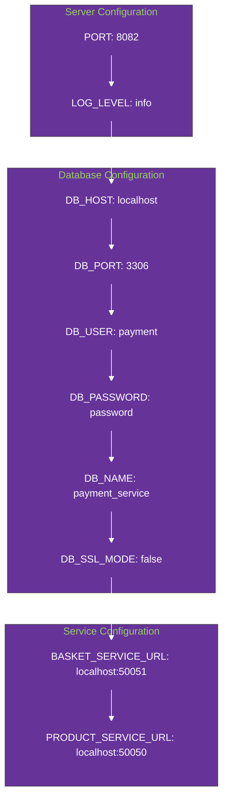

## Event-Driven Architecture with Kafka

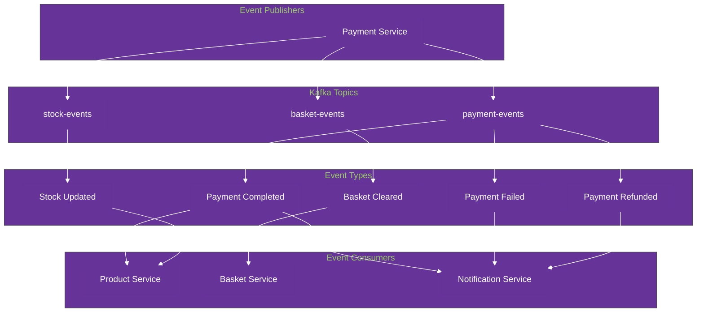

## Docker Services Configuration

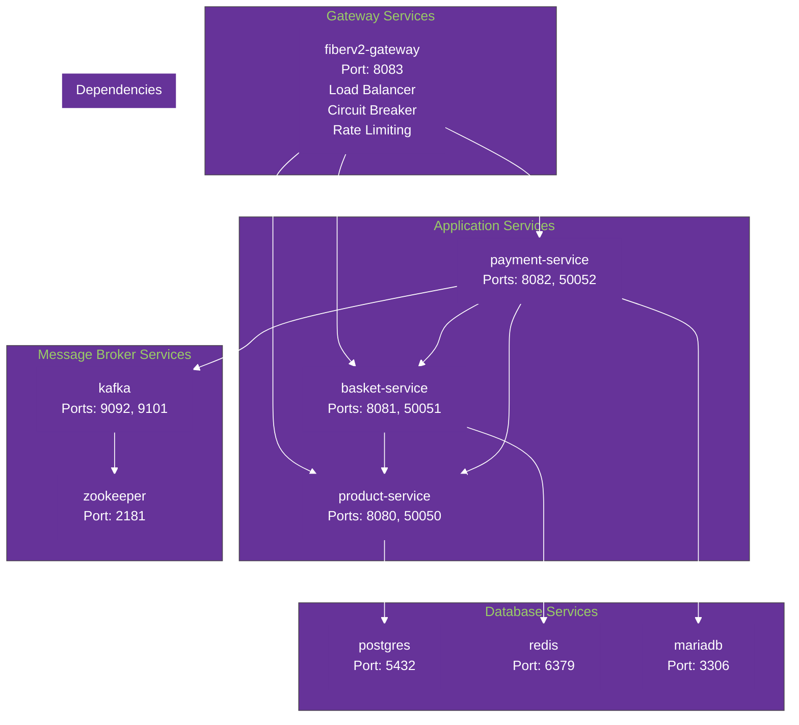

## Technology Stack

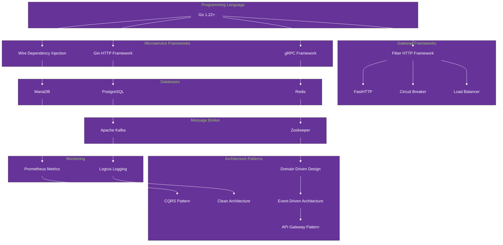

## Development Workflow

```mermaid
%%{init: {'theme':'base', 'themeVariables': { 'primaryColor': '#663399', 'primaryTextColor': '#ffffff', 'primaryBorderColor': '#663399', 'lineColor': '#ffffff', 'secondaryColor': '#663399', 'tertiaryColor': '#663399'}}}%%
graph LR
    subgraph "Setup Phase"
        Setup[make setup]
        InstallDeps[make install-deps]
        Proto[make proto]
    end
    
    subgraph "Development Phase"
        Dev[make dev]
        Build[make build]
        Test[make test]
        Lint[make lint]
    end
    
    subgraph "Deployment Phase"
        DockerBuild[make docker-build]
        DockerRun[make docker-run]
        ServicesStart[make services-start]
    end
    
    subgraph "Maintenance Phase"
        ServicesStop[make services-stop]
        ServicesRestart[make services-restart]
        Clean[make clean]
    end
    
    Setup --> InstallDeps
    InstallDeps --> Proto
    Proto --> Dev
    Dev --> Build
    Build --> Test
    Test --> Lint
    Lint --> DockerBuild
    DockerBuild --> DockerRun
    DockerRun --> ServicesStart
    ServicesStart --> ServicesStop
    ServicesStop --> ServicesRestart
    ServicesRestart --> Clean
```

## Database Schema Overview

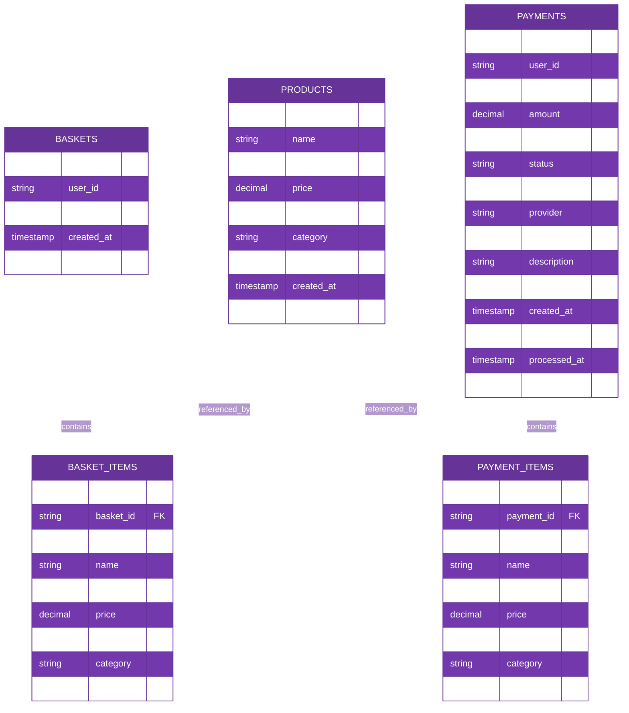

## API Request Flow

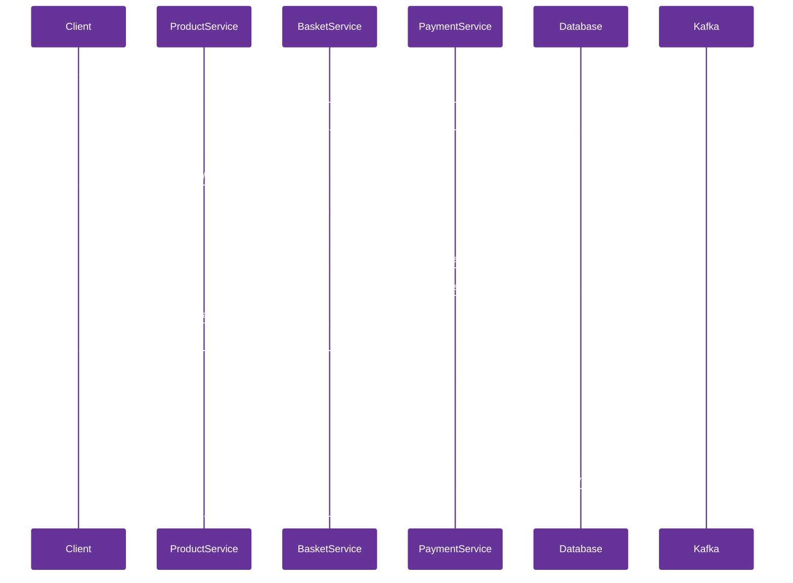

## Service Communication Flow

```mermaid
%%{init: {'theme':'base', 'themeVariables': { 'primaryColor': '#663399', 'primaryTextColor': '#ffffff', 'primaryBorderColor': '#663399', 'lineColor': '#ffffff', 'secondaryColor': '#663399', 'tertiaryColor': '#663399'}}}%%
graph TB
    subgraph "Client Layer"
        WebClient[Web Client]
        MobileClient[Mobile Client]
        APIClient[API Client]
    end
    
    subgraph "API Gateway Layer"
        FiberGateway[FiberV2 Gateway<br/>Port: 8083]
        LoadBalancer[Load Balancer<br/>Round Robin<br/>Least Connections]
        CircuitBreaker[Circuit Breaker<br/>Failure Detection<br/>Service Isolation]
        RateLimiter[Rate Limiter<br/>Request Throttling<br/>Burst Control]
        ReverseProxy[Reverse Proxy<br/>Request Forwarding<br/>Response Handling]
    end
    
    subgraph "Microservices Layer"
        ProductService[Product Service<br/>Port: 8080]
        BasketService[Basket Service<br/>Port: 8081]
        PaymentService[Payment Service<br/>Port: 8082]
    end
    
    subgraph "Data Layer"
        PostgreSQL[(PostgreSQL<br/>Port: 5432)]
        Redis[(Redis<br/>Port: 6379)]
        MariaDB[(MariaDB<br/>Port: 3306)]
    end
    
    subgraph "Message Layer"
        Kafka[Apache Kafka<br/>Port: 9092]
        Zookeeper[Zookeeper<br/>Port: 2181]
    end
    
    WebClient --> FiberGateway
    MobileClient --> FiberGateway
    APIClient --> FiberGateway
    
    FiberGateway --> LoadBalancer
    LoadBalancer --> CircuitBreaker
    CircuitBreaker --> RateLimiter
    RateLimiter --> ReverseProxy
    
    ReverseProxy --> ProductService
    ReverseProxy --> BasketService
    ReverseProxy --> PaymentService
    
    ProductService --> PostgreSQL
    BasketService --> Redis
    PaymentService --> MariaDB
    
    PaymentService --> Kafka
    Kafka --> Zookeeper
    
    BasketService --> ProductService
    PaymentService --> BasketService
    PaymentService --> ProductService
```

## Kubernetes Deployment Architecture

```mermaid
%%{init: {'theme':'base', 'themeVariables': { 'primaryColor': '#663399', 'primaryTextColor': '#ffffff', 'primaryBorderColor': '#663399', 'lineColor': '#ffffff', 'secondaryColor': '#663399', 'tertiaryColor': '#663399'}}}%%
graph TB
    subgraph "Kubernetes Cluster"
        subgraph "Ingress Layer"
            Ingress[Ingress Controller<br/>nginx-ingress<br/>SSL Termination<br/>Load Balancing]
        end
        
        subgraph "Application Layer"
            Gateway[Gateway Deployment<br/>3 Replicas<br/>LoadBalancer Service]
            ProductService[Product Service<br/>2 Replicas<br/>ClusterIP Service]
            BasketService[Basket Service<br/>2 Replicas<br/>ClusterIP Service]
            PaymentService[Payment Service<br/>2 Replicas<br/>ClusterIP Service]
        end
        
        subgraph "Data Layer"
            PostgreSQL[PostgreSQL<br/>Bitnami Chart<br/>8Gi Persistent Volume]
            Redis[Redis<br/>Bitnami Chart<br/>4Gi Persistent Volume]
            MariaDB[MariaDB<br/>Bitnami Chart<br/>8Gi Persistent Volume]
        end
        
        subgraph "Message Layer"
            Kafka[Kafka<br/>Bitnami Chart<br/>3 Replicas<br/>10Gi Persistent Volume]
            Zookeeper[Zookeeper<br/>Bitnami Chart<br/>3 Replicas]
        end
        
        subgraph "Monitoring Layer"
            ServiceMonitor[ServiceMonitor<br/>Prometheus Integration]
            HPA[Horizontal Pod Autoscaler<br/>CPU/Memory Based Scaling]
        end
        
        subgraph "Security Layer"
            NetworkPolicy[NetworkPolicy<br/>Traffic Isolation]
            ServiceAccount[ServiceAccount<br/>RBAC Integration]
            PodSecurityContext[Pod Security Context<br/>Non-root User<br/>Read-only Filesystem]
        end
    end
    
    subgraph "External Access"
        Client[External Client]
        LoadBalancer[Load Balancer<br/>AWS NLB / GCP LB]
    end
    
    Client --> LoadBalancer
    LoadBalancer --> Ingress
    Ingress --> Gateway
    
    Gateway --> ProductService
    Gateway --> BasketService
    Gateway --> PaymentService
    
    ProductService --> PostgreSQL
    BasketService --> Redis
    PaymentService --> MariaDB
    
    PaymentService --> Kafka
    Kafka --> Zookeeper
    
    BasketService --> ProductService
    PaymentService --> BasketService
    PaymentService --> ProductService
    
    Gateway --> ServiceMonitor
    Gateway --> HPA
    
    Gateway --> NetworkPolicy
    ProductService --> NetworkPolicy
    BasketService --> NetworkPolicy
    PaymentService --> NetworkPolicy
    
    Gateway --> ServiceAccount
    ProductService --> ServiceAccount
    BasketService --> ServiceAccount
    PaymentService --> ServiceAccount
```

## Helm Chart Structure

```mermaid
%%{init: {'theme':'base', 'themeVariables': { 'primaryColor': '#663399', 'primaryTextColor': '#ffffff', 'primaryBorderColor': '#663399', 'lineColor': '#ffffff', 'secondaryColor': '#663399', 'tertiaryColor': '#663399'}}}%%
graph TB
    subgraph "Helm Chart"
        ChartYaml[Chart.yaml<br/>Metadata & Dependencies]
        ValuesYaml[values.yaml<br/>Configuration Values]
        
        subgraph "Templates"
            Deployments[Deployments<br/>product-service<br/>basket-service<br/>payment-service<br/>gateway]
            Services[Services<br/>ClusterIP Services<br/>LoadBalancer Service]
            ConfigMaps[ConfigMaps<br/>Service Configurations]
            Ingress[Ingress<br/>External Access]
            ServiceAccount[ServiceAccount<br/>RBAC]
            NetworkPolicy[NetworkPolicy<br/>Security]
            ServiceMonitor[ServiceMonitor<br/>Monitoring]
            HPA[HPA<br/>Autoscaling]
        end
        
        subgraph "Dependencies"
            PostgreSQLChart[PostgreSQL Chart<br/>Bitnami]
            RedisChart[Redis Chart<br/>Bitnami]
            MariaDBChart[MariaDB Chart<br/>Bitnami]
            KafkaChart[Kafka Chart<br/>Bitnami]
        end
    end
    
    ChartYaml --> Deployments
    ValuesYaml --> Deployments
    
    Deployments --> Services
    Services --> ConfigMaps
    ConfigMaps --> Ingress
    Ingress --> ServiceAccount
    ServiceAccount --> NetworkPolicy
    NetworkPolicy --> ServiceMonitor
    ServiceMonitor --> HPA
    
    ChartYaml --> PostgreSQLChart
    ChartYaml --> RedisChart
    ChartYaml --> MariaDBChart
    ChartYaml --> KafkaChart
```

## Deployment Commands

```bash
# Install the Helm chart
helm install obs-tools-usage ./helm

# Upgrade the deployment
helm upgrade obs-tools-usage ./helm

# Check deployment status
helm status obs-tools-usage

# View all resources
kubectl get all -l app.kubernetes.io/name=obs-tools-usage

# Access the gateway
kubectl port-forward svc/obs-tools-usage-gateway 8080:8080

# View logs
kubectl logs -l app.kubernetes.io/component=gateway -f

# Scale services
kubectl scale deployment obs-tools-usage-gateway --replicas=5
```

## Environment Configuration

```mermaid
%%{init: {'theme':'base', 'themeVariables': { 'primaryColor': '#663399', 'primaryTextColor': '#ffffff', 'primaryBorderColor': '#663399', 'lineColor': '#ffffff', 'secondaryColor': '#663399', 'tertiaryColor': '#663399'}}}%%
graph TB
    subgraph "Production Environment"
        ProdValues[values.yaml<br/>Production Settings]
        ProdSecurity[Security Context<br/>Non-root User<br/>Read-only Filesystem]
        ProdResources[Resource Limits<br/>CPU: 1000m<br/>Memory: 1Gi]
        ProdPersistence[Persistent Volumes<br/>8Gi PostgreSQL<br/>4Gi Redis<br/>8Gi MariaDB<br/>10Gi Kafka]
    end
    
    subgraph "Development Environment"
        DevValues[values-dev.yaml<br/>Development Settings]
        DevSecurity[Relaxed Security<br/>Debug Mode]
        DevResources[Lower Resources<br/>CPU: 250m<br/>Memory: 256Mi]
        DevPersistence[Smaller Volumes<br/>1Gi each]
    end
    
    subgraph "Staging Environment"
        StagingValues[values-staging.yaml<br/>Staging Settings]
        StagingSecurity[Production-like Security]
        StagingResources[Medium Resources<br/>CPU: 500m<br/>Memory: 512Mi]
        StagingPersistence[Medium Volumes<br/>4Gi each]
    end
```

## Monitoring and Observability

```mermaid
%%{init: {'theme':'base', 'themeVariables': { 'primaryColor': '#663399', 'primaryTextColor': '#ffffff', 'primaryBorderColor': '#663399', 'lineColor': '#ffffff', 'secondaryColor': '#663399', 'tertiaryColor': '#663399'}}}%%
graph TB
    subgraph "Application Metrics"
        PrometheusMetrics[Prometheus Metrics<br/>Request Count<br/>Response Time<br/>Error Rate<br/>CPU Usage<br/>Memory Usage]
    end
    
    subgraph "Health Checks"
        LivenessProbe[Liveness Probe<br/>/health endpoint<br/>30s interval]
        ReadinessProbe[Readiness Probe<br/>/health/ready endpoint<br/>5s interval]
    end
    
    subgraph "Logging"
        StructuredLogs[Structured Logging<br/>JSON Format<br/>Request Tracking<br/>Error Logging]
    end
    
    subgraph "Service Discovery"
        ServiceMonitor[ServiceMonitor<br/>Prometheus Integration<br/>30s scrape interval]
    end
    
    subgraph "Autoscaling"
        HPA[HPA<br/>CPU-based Scaling<br/>Memory-based Scaling<br/>Min: 1, Max: 100]
    end
    
    PrometheusMetrics --> LivenessProbe
    LivenessProbe --> ReadinessProbe
    ReadinessProbe --> StructuredLogs
    StructuredLogs --> ServiceMonitor
    ServiceMonitor --> HPA
```

## AWS Infrastructure Architecture

```mermaid
%%{init: {'theme':'base', 'themeVariables': { 'primaryColor': '#663399', 'primaryTextColor': '#ffffff', 'primaryBorderColor': '#663399', 'lineColor': '#ffffff', 'secondaryColor': '#663399', 'tertiaryColor': '#663399'}}}%%
graph TB
    subgraph "AWS Cloud"
        subgraph "VPC Layer"
            VPC[VPC<br/>10.0.0.0/16<br/>3 AZs]
            PublicSubnets[Public Subnets<br/>Internet Gateway<br/>NAT Gateway]
            PrivateSubnets[Private Subnets<br/>EKS Cluster<br/>RDS Instances]
            IntraSubnets[Intra Subnets<br/>ElastiCache<br/>MSK Cluster]
        end
        
        subgraph "EKS Cluster"
            EKS[EKS Control Plane<br/>Kubernetes 1.28<br/>OIDC Provider]
            NodeGroups[Managed Node Groups<br/>ON_DEMAND + SPOT<br/>Auto Scaling]
            Addons[EKS Add-ons<br/>VPC CNI<br/>EBS CSI Driver<br/>CoreDNS]
        end
        
        subgraph "Data Layer"
            RDS[Amazon RDS<br/>PostgreSQL 15.4<br/>MariaDB 10.11<br/>Multi-AZ]
            ElastiCache[ElastiCache Redis<br/>Cluster Mode<br/>Encryption at Rest]
            MSK[Amazon MSK<br/>Kafka 3.5.1<br/>3 Brokers<br/>TLS Encryption]
        end
        
        subgraph "Security Layer"
            SecurityGroups[Security Groups<br/>EKS Cluster<br/>EKS Nodes<br/>RDS<br/>ElastiCache<br/>MSK]
            IAMRoles[IAM Roles<br/>AWS Load Balancer Controller<br/>External DNS<br/>RDS Enhanced Monitoring]
            KMS[KMS Keys<br/>RDS Encryption<br/>MSK Encryption<br/>EBS Encryption]
        end
        
        subgraph "Monitoring Layer"
            CloudWatch[CloudWatch<br/>Log Groups<br/>Metrics<br/>Alarms]
            VPCFlowLogs[VPC Flow Logs<br/>Network Traffic<br/>Security Analysis]
        end
    end
    
    subgraph "External Access"
        Internet[Internet]
        LoadBalancer[AWS Load Balancer<br/>Application Load Balancer<br/>Network Load Balancer]
    end
    
    Internet --> LoadBalancer
    LoadBalancer --> PublicSubnets
    PublicSubnets --> PrivateSubnets
    PrivateSubnets --> IntraSubnets
    
    VPC --> PublicSubnets
    VPC --> PrivateSubnets
    VPC --> IntraSubnets
    
    PrivateSubnets --> EKS
    EKS --> NodeGroups
    EKS --> Addons
    
    PrivateSubnets --> RDS
    IntraSubnets --> ElastiCache
    IntraSubnets --> MSK
    
    EKS --> SecurityGroups
    RDS --> SecurityGroups
    ElastiCache --> SecurityGroups
    MSK --> SecurityGroups
    
    EKS --> IAMRoles
    RDS --> KMS
    MSK --> KMS
    
    EKS --> CloudWatch
    RDS --> CloudWatch
    ElastiCache --> CloudWatch
    MSK --> CloudWatch
    VPC --> VPCFlowLogs
```

## Terraform Infrastructure Components

```mermaid
%%{init: {'theme':'base', 'themeVariables': { 'primaryColor': '#663399', 'primaryTextColor': '#ffffff', 'primaryBorderColor': '#663399', 'lineColor': '#ffffff', 'secondaryColor': '#663399', 'tertiaryColor': '#663399'}}}%%
graph TB
    subgraph "Terraform Configuration"
        MainTf[main.tf<br/>Provider Configuration<br/>Data Sources<br/>Local Values]
        VariablesTf[variables.tf<br/>Input Variables<br/>Validation Rules<br/>Default Values]
        OutputsTf[outputs.tf<br/>Resource Outputs<br/>Connection Info<br/>Configuration Data]
    end
    
    subgraph "Infrastructure Modules"
        VPCModule[VPC Module<br/>terraform-aws-modules/vpc/aws<br/>Subnets, Gateways<br/>Flow Logs]
        EKSModule[EKS Module<br/>terraform-aws-modules/eks/aws<br/>Control Plane<br/>Node Groups<br/>Add-ons]
    end
    
    subgraph "AWS Resources"
        VPCResources[VPC Resources<br/>VPC, Subnets<br/>Internet Gateway<br/>NAT Gateway<br/>Route Tables]
        EKSResources[EKS Resources<br/>EKS Cluster<br/>Node Groups<br/>Security Groups<br/>IAM Roles]
        RDSResources[RDS Resources<br/>PostgreSQL Instance<br/>MariaDB Instance<br/>Subnet Groups<br/>Parameter Groups]
        CacheResources[ElastiCache Resources<br/>Redis Cluster<br/>Subnet Groups<br/>Parameter Groups]
        MSKResources[MSK Resources<br/>Kafka Cluster<br/>Configuration<br/>KMS Keys]
    end
    
    subgraph "Security & Policies"
        IAMPolicies[IAM Policies<br/>AWS Load Balancer Controller<br/>External DNS<br/>RDS Enhanced Monitoring]
        SecurityGroups[Security Groups<br/>EKS Cluster<br/>EKS Nodes<br/>RDS<br/>ElastiCache<br/>MSK]
        KMSKeys[KMS Keys<br/>RDS Encryption<br/>MSK Encryption<br/>EBS Encryption]
    end
    
    subgraph "Monitoring & Logging"
        CloudWatchLogs[CloudWatch Logs<br/>EKS Cluster Logs<br/>RDS Logs<br/>ElastiCache Logs<br/>MSK Logs]
        VPCFlowLogs[VPC Flow Logs<br/>Network Traffic<br/>Security Analysis]
    end
    
    MainTf --> VPCModule
    MainTf --> EKSModule
    VariablesTf --> VPCModule
    VariablesTf --> EKSModule
    
    VPCModule --> VPCResources
    EKSModule --> EKSResources
    
    VPCResources --> RDSResources
    VPCResources --> CacheResources
    VPCResources --> MSKResources
    
    EKSResources --> IAMPolicies
    RDSResources --> SecurityGroups
    CacheResources --> SecurityGroups
    MSKResources --> SecurityGroups
    
    RDSResources --> KMSKeys
    MSKResources --> KMSKeys
    
    EKSResources --> CloudWatchLogs
    RDSResources --> CloudWatchLogs
    CacheResources --> CloudWatchLogs
    MSKResources --> CloudWatchLogs
    VPCResources --> VPCFlowLogs
```

## Ansible Configuration Management

```mermaid
%%{init: {'theme':'base', 'themeVariables': { 'primaryColor': '#663399', 'primaryTextColor': '#ffffff', 'primaryBorderColor': '#663399', 'lineColor': '#ffffff', 'secondaryColor': '#663399', 'tertiaryColor': '#663399'}}}%%
graph TB
    subgraph "Ansible Playbooks"
        MainPlaybook[main.yml<br/>Main Playbook<br/>Host Configuration<br/>Role Execution]
        K8sPlaybook[k8s-setup.yml<br/>Kubernetes Setup<br/>Helm Installation<br/>Add-on Configuration]
        AppPlaybook[app-deploy.yml<br/>Application Deployment<br/>Helm Chart Installation<br/>Configuration Management]
    end
    
    subgraph "Ansible Roles"
        CommonRole[common<br/>System Updates<br/>Package Installation<br/>User Management]
        DockerRole[docker<br/>Docker Installation<br/>Docker Compose<br/>Container Management]
        K8sRole[kubernetes<br/>kubectl Installation<br/>kubeconfig Setup<br/>Cluster Access]
        HelmRole[helm<br/>Helm Installation<br/>Repository Management<br/>Chart Operations]
        MonitoringRole[monitoring<br/>Prometheus Setup<br/>Grafana Configuration<br/>Alert Rules]
    end
    
    subgraph "Configuration Files"
        Inventory[inventory.yml<br/>Host Definitions<br/>Group Variables<br/>Connection Settings]
        GroupVars[group_vars/<br/>Environment Variables<br/>Secrets Management<br/>Configuration Values]
        HostVars[host_vars/<br/>Host-specific Variables<br/>Individual Configurations]
    end
    
    subgraph "Templates & Files"
        ConfigTemplates[config_templates/<br/>Application Configs<br/>Service Definitions<br/>Environment Files]
        Scripts[scripts/<br/>Deployment Scripts<br/>Health Checks<br/>Backup Scripts]
        Secrets[secrets/<br/>Encrypted Variables<br/>API Keys<br/>Database Credentials]
    end
    
    subgraph "Target Infrastructure"
        EKSCluster[EKS Cluster<br/>Kubernetes Nodes<br/>Application Pods<br/>Services]
        Databases[Databases<br/>RDS PostgreSQL<br/>RDS MariaDB<br/>ElastiCache Redis]
        MessageBroker[Message Broker<br/>MSK Kafka<br/>Topics<br/>Producers/Consumers]
        Monitoring[Monitoring Stack<br/>Prometheus<br/>Grafana<br/>AlertManager]
    end
    
    MainPlaybook --> CommonRole
    MainPlaybook --> DockerRole
    K8sPlaybook --> K8sRole
    K8sPlaybook --> HelmRole
    AppPlaybook --> MonitoringRole
    
    Inventory --> GroupVars
    Inventory --> HostVars
    GroupVars --> ConfigTemplates
    HostVars --> Scripts
    ConfigTemplates --> Secrets
    
    CommonRole --> EKSCluster
    DockerRole --> EKSCluster
    K8sRole --> EKSCluster
    HelmRole --> EKSCluster
    MonitoringRole --> Monitoring
    
    EKSCluster --> Databases
    EKSCluster --> MessageBroker
    EKSCluster --> Monitoring
```

## Infrastructure Deployment Flow

```mermaid
%%{init: {'theme':'base', 'themeVariables': { 'primaryColor': '#663399', 'primaryTextColor': '#ffffff', 'primaryBorderColor': '#663399', 'lineColor': '#ffffff', 'secondaryColor': '#663399', 'tertiaryColor': '#663399'}}}%%
graph LR
    subgraph "Phase 1: Infrastructure"
        TerraformInit[terraform init<br/>Provider Setup<br/>Module Download]
        TerraformPlan[terraform plan<br/>Resource Planning<br/>Change Detection]
        TerraformApply[terraform apply<br/>Resource Creation<br/>State Management]
    end
    
    subgraph "Phase 2: Configuration"
        AnsibleInventory[ansible-inventory<br/>Host Discovery<br/>Group Assignment]
        AnsiblePlaybook[ansible-playbook<br/>Configuration Management<br/>Role Execution]
        AnsibleVerify[ansible-verify<br/>Configuration Validation<br/>Health Checks]
    end
    
    subgraph "Phase 3: Application"
        HelmRepo[helm repo add<br/>Repository Setup<br/>Chart Discovery]
        HelmInstall[helm install<br/>Application Deployment<br/>Resource Creation]
        HelmUpgrade[helm upgrade<br/>Application Updates<br/>Rolling Deployments]
    end
    
    subgraph "Phase 4: Monitoring"
        PrometheusSetup[Prometheus Setup<br/>Metrics Collection<br/>Service Discovery]
        GrafanaSetup[Grafana Setup<br/>Dashboard Creation<br/>Alert Configuration]
        LoggingSetup[Logging Setup<br/>Centralized Logs<br/>Log Aggregation]
    end
    
    TerraformInit --> TerraformPlan
    TerraformPlan --> TerraformApply
    TerraformApply --> AnsibleInventory
    
    AnsibleInventory --> AnsiblePlaybook
    AnsiblePlaybook --> AnsibleVerify
    AnsibleVerify --> HelmRepo
    
    HelmRepo --> HelmInstall
    HelmInstall --> HelmUpgrade
    HelmUpgrade --> PrometheusSetup
    
    PrometheusSetup --> GrafanaSetup
    GrafanaSetup --> LoggingSetup
```

## Environment-Specific Configurations

```mermaid
%%{init: {'theme':'base', 'themeVariables': { 'primaryColor': '#663399', 'primaryTextColor': '#ffffff', 'primaryBorderColor': '#663399', 'lineColor': '#ffffff', 'secondaryColor': '#663399', 'tertiaryColor': '#663399'}}}%%
graph TB
    subgraph "Development Environment"
        DevTerraform[terraform.tfvars.dev<br/>Small Instance Types<br/>Single AZ<br/>Minimal Resources]
        DevAnsible[group_vars/dev/<br/>Debug Logging<br/>Development Tools<br/>Local Access]
        DevHelm[values-dev.yaml<br/>Development Settings<br/>Debug Mode<br/>Local Storage]
    end
    
    subgraph "Staging Environment"
        StagingTerraform[terraform.tfvars.staging<br/>Medium Instance Types<br/>Multi-AZ<br/>Production-like]
        StagingAnsible[group_vars/staging/<br/>Production Config<br/>Security Hardening<br/>Monitoring]
        StagingHelm[values-staging.yaml<br/>Staging Settings<br/>Production-like Config<br/>External Storage]
    end
    
    subgraph "Production Environment"
        ProdTerraform[terraform.tfvars.prod<br/>Large Instance Types<br/>Multi-AZ<br/>High Availability]
        ProdAnsible[group_vars/prod/<br/>Production Config<br/>Security Hardening<br/>Compliance]
        ProdHelm[values-prod.yaml<br/>Production Settings<br/>High Availability<br/>External Storage]
    end
    
    subgraph "Configuration Management"
        TerraformVars[terraform.tfvars<br/>Environment Variables<br/>Resource Sizing<br/>Feature Flags]
        AnsibleVars[group_vars/<br/>Application Config<br/>Secrets Management<br/>Environment-specific]
        HelmValues[values.yaml<br/>Application Settings<br/>Resource Limits<br/>Scaling Config]
    end
    
    DevTerraform --> TerraformVars
    StagingTerraform --> TerraformVars
    ProdTerraform --> TerraformVars
    
    DevAnsible --> AnsibleVars
    StagingAnsible --> AnsibleVars
    ProdAnsible --> AnsibleVars
    
    DevHelm --> HelmValues
    StagingHelm --> HelmValues
    ProdHelm --> HelmValues
```

## Security and Compliance

```mermaid
%%{init: {'theme':'base', 'themeVariables': { 'primaryColor': '#663399', 'primaryTextColor': '#ffffff', 'primaryBorderColor': '#663399', 'lineColor': '#ffffff', 'secondaryColor': '#663399', 'tertiaryColor': '#663399'}}}%%
graph TB
    subgraph "Network Security"
        VPCFlowLogs[VPC Flow Logs<br/>Network Traffic Analysis<br/>Security Monitoring]
        SecurityGroups[Security Groups<br/>Port-based Access Control<br/>Source/Destination Rules]
        NACLs[Network ACLs<br/>Subnet-level Security<br/>Traffic Filtering]
    end
    
    subgraph "Identity and Access"
        IAMRoles[IAM Roles<br/>Service Accounts<br/>Least Privilege Access]
        RBAC[Kubernetes RBAC<br/>Role-based Access<br/>Service Account Permissions]
        OIDC[OIDC Provider<br/>Identity Federation<br/>Token-based Access]
    end
    
    subgraph "Data Protection"
        EncryptionAtRest[Encryption at Rest<br/>RDS Encryption<br/>EBS Encryption<br/>S3 Encryption]
        EncryptionInTransit[Encryption in Transit<br/>TLS/SSL<br/>mTLS<br/>Certificate Management]
        SecretsManagement[Secrets Management<br/>AWS Secrets Manager<br/>Kubernetes Secrets<br/>Encrypted Variables]
    end
    
    subgraph "Monitoring and Compliance"
        CloudTrail[AWS CloudTrail<br/>API Activity Logging<br/>Audit Trail]
        Config[AWS Config<br/>Resource Compliance<br/>Configuration Drift]
        GuardDuty[Amazon GuardDuty<br/>Threat Detection<br/>Security Analysis]
    end
    
    subgraph "Application Security"
        PodSecurity[Pod Security Standards<br/>Non-root Containers<br/>Read-only Filesystem]
        NetworkPolicies[Network Policies<br/>Traffic Isolation<br/>Micro-segmentation]
        ImageSecurity[Container Image Security<br/>Vulnerability Scanning<br/>Image Signing]
    end
    
    VPCFlowLogs --> SecurityGroups
    SecurityGroups --> NACLs
    NACLs --> IAMRoles
    
    IAMRoles --> RBAC
    RBAC --> OIDC
    OIDC --> EncryptionAtRest
    
    EncryptionAtRest --> EncryptionInTransit
    EncryptionInTransit --> SecretsManagement
    SecretsManagement --> CloudTrail
    
    CloudTrail --> Config
    Config --> GuardDuty
    GuardDuty --> PodSecurity
    
    PodSecurity --> NetworkPolicies
    NetworkPolicies --> ImageSecurity
```

## CI/CD Pipeline Architecture

```mermaid
%%{init: {'theme':'base', 'themeVariables': { 'primaryColor': '#663399', 'primaryTextColor': '#ffffff', 'primaryBorderColor': '#663399', 'lineColor': '#ffffff', 'secondaryColor': '#663399', 'tertiaryColor': '#663399'}}}%%
graph TB
    subgraph "Source Control"
        GitHub[GitHub Repository<br/>Code Push/Pull Request<br/>Release Triggers]
    end
    
    subgraph "CI/CD Pipeline"
        subgraph "Continuous Integration"
            CodeCheckout[Code Checkout<br/>Branch Detection<br/>Environment Selection]
            TestAndBuild[Test & Build<br/>Go Tests<br/>Linting<br/>Security Scan<br/>Docker Build]
            QualityGates[Quality Gates<br/>Test Coverage<br/>Security Scan<br/>Code Quality]
        end
        
        subgraph "Continuous Deployment"
            DevDeploy[Development Deploy<br/>Auto Deploy on develop<br/>Terraform + Ansible<br/>Helm Charts]
            StagingDeploy[Staging Deploy<br/>Auto Deploy on main<br/>Production-like Environment<br/>Integration Tests]
            ProdDeploy[Production Deploy<br/>Manual Release Trigger<br/>Blue-Green Deployment<br/>Rollback Capability]
        end
        
        subgraph "Post-Deployment"
            HealthChecks[Health Checks<br/>Service Availability<br/>Performance Monitoring<br/>Alert Notifications]
            PerformanceTests[Performance Tests<br/>Load Testing<br/>Stress Testing<br/>Database Performance]
            Monitoring[Monitoring<br/>Metrics Collection<br/>Log Aggregation<br/>Alert Management]
        end
    end
    
    subgraph "Environments"
        DevEnv[Development<br/>Fast Iteration<br/>Debug Mode<br/>Minimal Resources]
        StagingEnv[Staging<br/>Production-like<br/>Integration Tests<br/>Performance Tests]
        ProdEnv[Production<br/>High Availability<br/>Security Hardening<br/>Monitoring]
    end
    
    subgraph "Infrastructure"
        AWSInfra[AWS Infrastructure<br/>EKS Clusters<br/>RDS Databases<br/>ElastiCache<br/>MSK Kafka]
        K8sCluster[Kubernetes Clusters<br/>Application Pods<br/>Services<br/>Ingress<br/>ConfigMaps]
    end
    
    GitHub --> CodeCheckout
    CodeCheckout --> TestAndBuild
    TestAndBuild --> QualityGates
    
    QualityGates --> DevDeploy
    QualityGates --> StagingDeploy
    QualityGates --> ProdDeploy
    
    DevDeploy --> DevEnv
    StagingDeploy --> StagingEnv
    ProdDeploy --> ProdEnv
    
    DevEnv --> HealthChecks
    StagingEnv --> HealthChecks
    ProdEnv --> HealthChecks
    
    HealthChecks --> PerformanceTests
    PerformanceTests --> Monitoring
    
    DevEnv --> AWSInfra
    StagingEnv --> AWSInfra
    ProdEnv --> AWSInfra
    
    AWSInfra --> K8sCluster
```

## CI/CD Pipeline Stages

```mermaid
%%{init: {'theme':'base', 'themeVariables': { 'primaryColor': '#663399', 'primaryTextColor': '#ffffff', 'primaryBorderColor': '#663399', 'lineColor': '#ffffff', 'secondaryColor': '#663399', 'tertiaryColor': '#663399'}}}%%
graph LR
    subgraph "Stage 1: Code Quality"
        CodePush[Code Push/PR<br/>GitHub Trigger]
        LintCheck[Linting<br/>golangci-lint<br/>ansible-lint<br/>terraform fmt]
        SecurityScan[Security Scan<br/>Trivy<br/>Gosec<br/>Checkov]
        TestRun[Test Execution<br/>Unit Tests<br/>Integration Tests<br/>Coverage Report]
    end
    
    subgraph "Stage 2: Build & Package"
        DockerBuild[Docker Build<br/>Multi-stage Build<br/>Image Optimization<br/>Security Scanning]
        ImagePush[Image Push<br/>GitHub Container Registry<br/>Tag Management<br/>Vulnerability Scan]
        HelmPackage[Helm Package<br/>Chart Validation<br/>Template Testing<br/>Dependency Check]
    end
    
    subgraph "Stage 3: Infrastructure"
        TerraformPlan[Terraform Plan<br/>Resource Planning<br/>Change Detection<br/>Cost Estimation]
        TerraformApply[Terraform Apply<br/>Infrastructure Creation<br/>State Management<br/>Rollback Capability]
        AnsibleConfig[Ansible Configuration<br/>System Setup<br/>Service Configuration<br/>Security Hardening]
    end
    
    subgraph "Stage 4: Deployment"
        K8sDeploy[Kubernetes Deployment<br/>Namespace Creation<br/>Resource Deployment<br/>Service Configuration]
        HealthCheck[Health Checks<br/>Pod Readiness<br/>Service Availability<br/>Endpoint Testing]
        SmokeTest[Smoke Tests<br/>API Endpoint Tests<br/>Database Connectivity<br/>Service Integration]
    end
    
    subgraph "Stage 5: Validation"
        LoadTest[Load Testing<br/>k6 Performance Tests<br/>Response Time Validation<br/>Throughput Testing]
        SecurityTest[Security Testing<br/>Vulnerability Scan<br/>Penetration Testing<br/>Compliance Check]
        MonitoringSetup[Monitoring Setup<br/>Prometheus Configuration<br/>Grafana Dashboards<br/>Alert Rules]
    end
    
    CodePush --> LintCheck
    LintCheck --> SecurityScan
    SecurityScan --> TestRun
    TestRun --> DockerBuild
    
    DockerBuild --> ImagePush
    ImagePush --> HelmPackage
    HelmPackage --> TerraformPlan
    
    TerraformPlan --> TerraformApply
    TerraformApply --> AnsibleConfig
    AnsibleConfig --> K8sDeploy
    
    K8sDeploy --> HealthCheck
    HealthCheck --> SmokeTest
    SmokeTest --> LoadTest
    
    LoadTest --> SecurityTest
    SecurityTest --> MonitoringSetup
```

## GitHub Actions Workflows

```mermaid
%%{init: {'theme':'base', 'themeVariables': { 'primaryColor': '#663399', 'primaryTextColor': '#ffffff', 'primaryBorderColor': '#663399', 'lineColor': '#ffffff', 'secondaryColor': '#663399', 'tertiaryColor': '#663399'}}}%%
graph TB
    subgraph "Main CI/CD Workflow"
        CICDTrigger[Trigger Events<br/>Push to main/develop<br/>Pull Request<br/>Release]
        TestBuildJob[Test & Build Job<br/>Go Tests<br/>Docker Build<br/>Security Scan]
        InfraTestJob[Infrastructure Test<br/>Terraform Validate<br/>Ansible Lint<br/>Helm Lint]
        DeployDevJob[Deploy to Dev<br/>Auto Deploy<br/>Terraform Apply<br/>Ansible Playbook]
        DeployStagingJob[Deploy to Staging<br/>Auto Deploy<br/>Production-like<br/>Integration Tests]
        DeployProdJob[Deploy to Production<br/>Manual Trigger<br/>Release-based<br/>Blue-Green Deploy]
    end
    
    subgraph "Security Workflow"
        SecurityTrigger[Security Trigger<br/>Daily Schedule<br/>Push Events<br/>PR Events]
        DepScanJob[Dependency Scan<br/>Go Security Audit<br/>Vulnerability Check<br/>License Check]
        ContainerScanJob[Container Scan<br/>Trivy Scanner<br/>Image Vulnerability<br/>Base Image Check]
        InfraScanJob[Infrastructure Scan<br/>Checkov Scanner<br/>Terraform Security<br/>AWS Best Practices]
        SecretsScanJob[Secrets Scan<br/>TruffleHog<br/>Credential Detection<br/>API Key Check]
    end
    
    subgraph "Performance Workflow"
        PerfTrigger[Performance Trigger<br/>Weekly Schedule<br/>Manual Trigger<br/>Post-Deployment]
        LoadTestJob[Load Testing<br/>k6 Load Tests<br/>Response Time<br/>Throughput Testing]
        StressTestJob[Stress Testing<br/>k6 Stress Tests<br/>Breaking Point<br/>Resource Limits]
        DBPerfJob[Database Performance<br/>Query Performance<br/>Connection Pool<br/>Index Optimization]
        ProfilingJob[Profiling<br/>CPU Profiling<br/>Memory Profiling<br/>Performance Analysis]
    end
    
    subgraph "Notification Workflow"
        NotifyTrigger[Notification Trigger<br/>Deployment Status<br/>Test Results<br/>Security Alerts]
        SlackNotify[Slack Notification<br/>Deployment Status<br/>Test Results<br/>Error Alerts]
        EmailNotify[Email Notification<br/>Security Alerts<br/>Critical Issues<br/>Weekly Reports]
        WebhookNotify[Webhook Notification<br/>External Systems<br/>Monitoring Tools<br/>Alert Management]
    end
    
    CICDTrigger --> TestBuildJob
    TestBuildJob --> InfraTestJob
    InfraTestJob --> DeployDevJob
    DeployDevJob --> DeployStagingJob
    DeployStagingJob --> DeployProdJob
    
    SecurityTrigger --> DepScanJob
    DepScanJob --> ContainerScanJob
    ContainerScanJob --> InfraScanJob
    InfraScanJob --> SecretsScanJob
    
    PerfTrigger --> LoadTestJob
    LoadTestJob --> StressTestJob
    StressTestJob --> DBPerfJob
    DBPerfJob --> ProfilingJob
    
    DeployProdJob --> NotifyTrigger
    SecretsScanJob --> NotifyTrigger
    ProfilingJob --> NotifyTrigger
    
    NotifyTrigger --> SlackNotify
    NotifyTrigger --> EmailNotify
    NotifyTrigger --> WebhookNotify
```

## Deployment Strategies

```mermaid
%%{init: {'theme':'base', 'themeVariables': { 'primaryColor': '#663399', 'primaryTextColor': '#ffffff', 'primaryBorderColor': '#663399', 'lineColor': '#ffffff', 'secondaryColor': '#663399', 'tertiaryColor': '#663399'}}}%%
graph TB
    subgraph "Development Deployment"
        DevStrategy[Fast Deployment<br/>Immediate Updates<br/>Debug Mode<br/>Hot Reload]
        DevRollback[Quick Rollback<br/>Git Revert<br/>Docker Image Rollback<br/>Configuration Reset]
    end
    
    subgraph "Staging Deployment"
        StagingStrategy[Production-like<br/>Integration Testing<br/>Performance Testing<br/>Security Testing]
        StagingValidation[Validation Tests<br/>API Testing<br/>Database Testing<br/>End-to-End Tests]
    end
    
    subgraph "Production Deployment"
        BlueGreen[Blue-Green Deployment<br/>Zero Downtime<br/>Instant Rollback<br/>Traffic Switching]
        Canary[Canary Deployment<br/>Gradual Rollout<br/>A/B Testing<br/>Risk Mitigation]
        Rolling[Rolling Deployment<br/>Gradual Update<br/>Service Continuity<br/>Resource Management]
    end
    
    subgraph "Rollback Strategies"
        AutoRollback[Automatic Rollback<br/>Health Check Failure<br/>Performance Degradation<br/>Error Rate Threshold]
        ManualRollback[Manual Rollback<br/>Admin Decision<br/>Emergency Response<br/>Quick Recovery]
        DatabaseRollback[Database Rollback<br/>Migration Rollback<br/>Data Consistency<br/>Backup Restoration]
    end
    
    DevStrategy --> DevRollback
    StagingStrategy --> StagingValidation
    StagingValidation --> BlueGreen
    
    BlueGreen --> Canary
    Canary --> Rolling
    Rolling --> AutoRollback
    
    AutoRollback --> ManualRollback
    ManualRollback --> DatabaseRollback
```

## Monitoring and Alerting

```mermaid
%%{init: {'theme':'base', 'themeVariables': { 'primaryColor': '#663399', 'primaryTextColor': '#ffffff', 'primaryBorderColor': '#663399', 'lineColor': '#ffffff', 'secondaryColor': '#663399', 'tertiaryColor': '#663399'}}}%%
graph TB
    subgraph "Application Monitoring"
        AppMetrics[Application Metrics<br/>Request Rate<br/>Response Time<br/>Error Rate<br/>Throughput]
        BusinessMetrics[Business Metrics<br/>User Activity<br/>Transaction Volume<br/>Revenue Metrics<br/>Conversion Rate]
    end
    
    subgraph "Infrastructure Monitoring"
        SystemMetrics[System Metrics<br/>CPU Usage<br/>Memory Usage<br/>Disk I/O<br/>Network I/O]
        K8sMetrics[Kubernetes Metrics<br/>Pod Status<br/>Node Health<br/>Resource Usage<br/>Cluster Health]
    end
    
    subgraph "Database Monitoring"
        DBMetrics[Database Metrics<br/>Query Performance<br/>Connection Pool<br/>Lock Contention<br/>Replication Lag]
        CacheMetrics[Cache Metrics<br/>Hit Rate<br/>Miss Rate<br/>Memory Usage<br/>Eviction Rate]
    end
    
    subgraph "Security Monitoring"
        SecurityMetrics[Security Metrics<br/>Failed Logins<br/>Suspicious Activity<br/>Vulnerability Scan<br/>Compliance Status]
        AuditLogs[Audit Logs<br/>User Actions<br/>System Changes<br/>Access Logs<br/>Security Events]
    end
    
    subgraph "Alerting System"
        AlertRules[Alert Rules<br/>Threshold-based<br/>Anomaly Detection<br/>Trend Analysis<br/>Predictive Alerts]
        NotificationChannels[Notification Channels<br/>Slack<br/>Email<br/>PagerDuty<br/>Webhooks]
        EscalationPolicy[Escalation Policy<br/>Severity Levels<br/>Response Time<br/>Escalation Path<br/>On-call Rotation]
    end
    
    AppMetrics --> AlertRules
    BusinessMetrics --> AlertRules
    SystemMetrics --> AlertRules
    K8sMetrics --> AlertRules
    DBMetrics --> AlertRules
    CacheMetrics --> AlertRules
    SecurityMetrics --> AlertRules
    AuditLogs --> AlertRules
    
    AlertRules --> NotificationChannels
    NotificationChannels --> EscalationPolicy
```