# Microservices Architecture

## System Overview

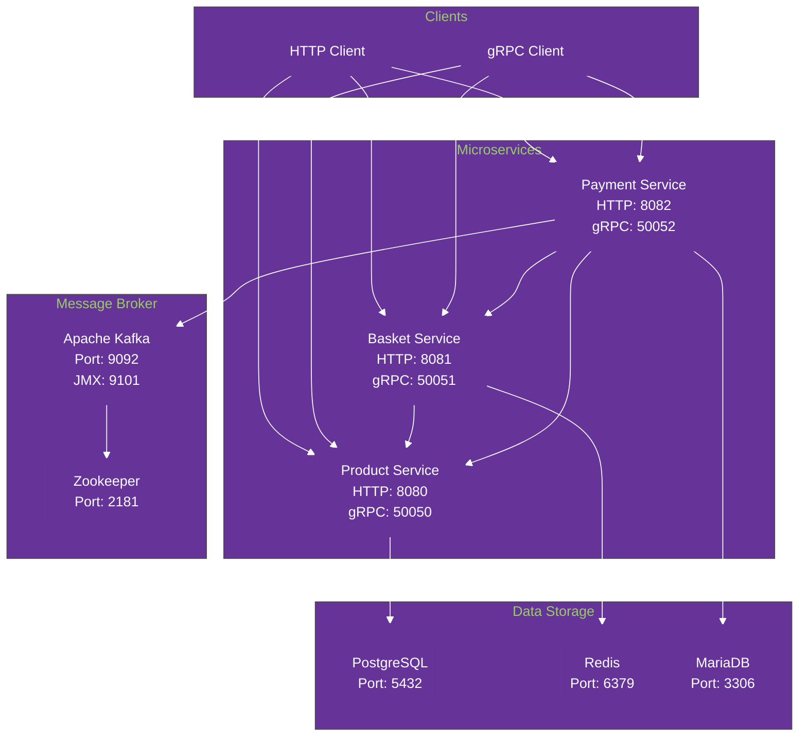

## Product Service Architecture

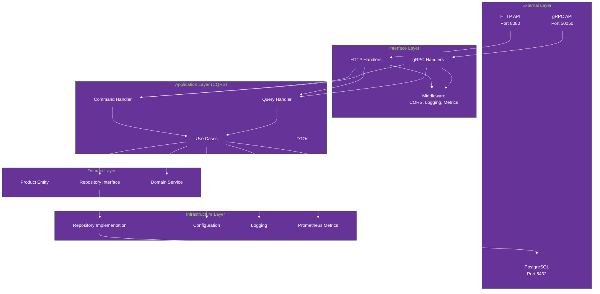

## Product Service API Endpoints

```mermaid
%%{init: {'theme':'base', 'themeVariables': { 'primaryColor': '#663399', 'primaryTextColor': '#ffffff', 'primaryBorderColor': '#663399', 'lineColor': '#ffffff', 'secondaryColor': '#663399', 'tertiaryColor': '#663399'}}}%%
graph LR
    subgraph "HTTP Endpoints"
        GET1[GET /products<br/>Get all products]
        GET2[GET /products/{id}<br/>Get product by ID]
        POST[POST /products<br/>Create new product]
        PUT[PUT /products/{id}<br/>Update product]
        DELETE[DELETE /products/{id}<br/>Delete product]
        HEALTH[GET /health<br/>Health check]
    end
    
    subgraph "gRPC Methods"
        CreateProduct[CreateProduct]
        GetProduct[GetProduct]
        GetProducts[GetProducts]
        UpdateProduct[UpdateProduct]
        DeleteProduct[DeleteProduct]
    end
```

## Product Service Environment Variables

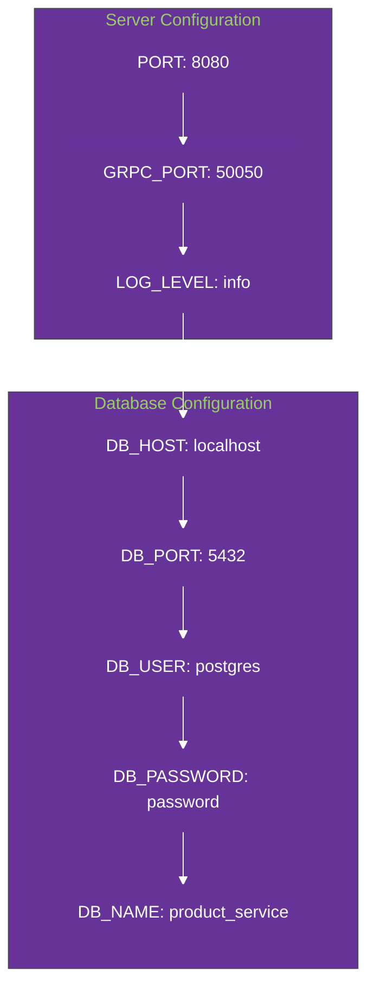

## Basket Service Architecture

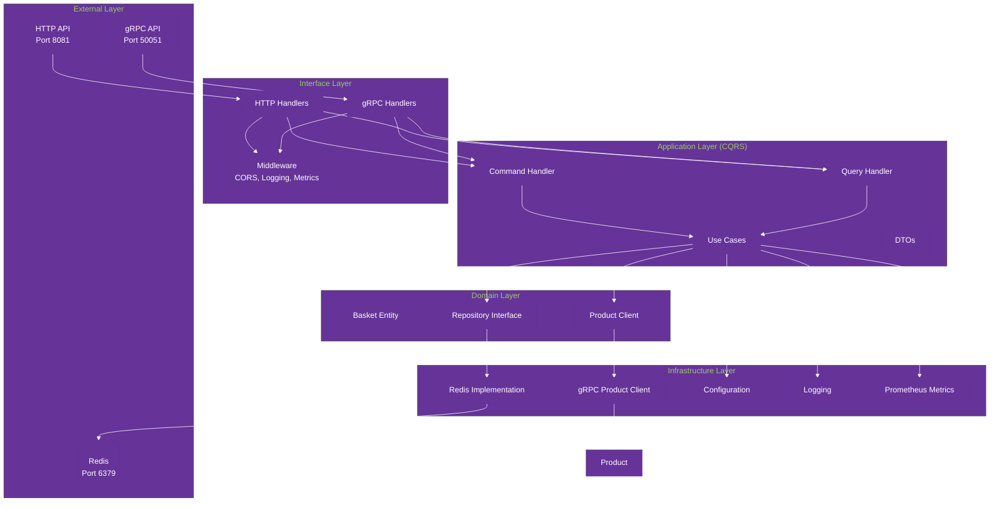

## Basket Service API Endpoints

```mermaid
%%{init: {'theme':'base', 'themeVariables': { 'primaryColor': '#663399', 'primaryTextColor': '#ffffff', 'primaryBorderColor': '#663399', 'lineColor': '#ffffff', 'secondaryColor': '#663399', 'tertiaryColor': '#663399'}}}%%
graph LR
    subgraph "Basket Management"
        GET_BASKET[GET /baskets/{user_id}<br/>Get user basket]
        CREATE_BASKET[POST /baskets<br/>Create new basket]
        DELETE_BASKET[DELETE /baskets/{user_id}<br/>Delete basket]
    end
    
    subgraph "Item Management"
        ADD_ITEM[POST /baskets/{user_id}/items<br/>Add item]
        UPDATE_ITEM[PUT /baskets/{user_id}/items/{product_id}<br/>Update quantity]
        REMOVE_ITEM[DELETE /baskets/{user_id}/items/{product_id}<br/>Remove item]
        CLEAR_ITEMS[DELETE /baskets/{user_id}/items<br/>Clear all items]
    end
    
    subgraph "Health Check"
        HEALTH[GET /health<br/>Health check]
    end
    
    GET_BASKET --> ADD_ITEM
    ADD_ITEM --> UPDATE_ITEM
    UPDATE_ITEM --> REMOVE_ITEM
    REMOVE_ITEM --> CLEAR_ITEMS
    CLEAR_ITEMS --> HEALTH
```

## Basket Service Environment Variables

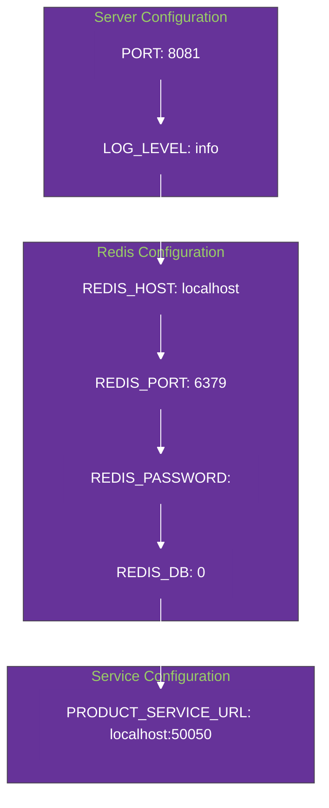

## Payment Service Architecture

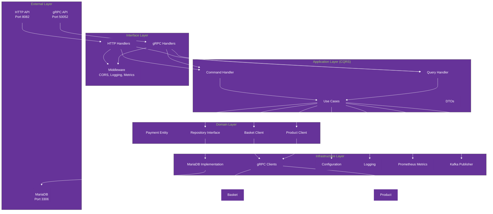

## Payment Service API Endpoints

```mermaid
%%{init: {'theme':'base', 'themeVariables': { 'primaryColor': '#663399', 'primaryTextColor': '#ffffff', 'primaryBorderColor': '#663399', 'lineColor': '#ffffff', 'secondaryColor': '#663399', 'tertiaryColor': '#663399'}}}%%
graph LR
    subgraph "Payment Management"
        CREATE_PAYMENT[POST /payments<br/>Create payment]
        GET_PAYMENT[GET /payments/{id}<br/>Get payment]
        PROCESS_PAYMENT[POST /payments/{id}/process<br/>Process payment]
        CANCEL_PAYMENT[POST /payments/{id}/cancel<br/>Cancel payment]
        REFUND_PAYMENT[POST /payments/{id}/refund<br/>Refund payment]
    end
    
    subgraph "Payment History"
        GET_PAYMENTS[GET /payments<br/>Get all payments]
        GET_USER_PAYMENTS[GET /users/{user_id}/payments<br/>Get user payments]
    end
    
    subgraph "Health Check"
        HEALTH[GET /health<br/>Health check]
    end
    
    CREATE_PAYMENT --> GET_PAYMENT
    GET_PAYMENT --> PROCESS_PAYMENT
    PROCESS_PAYMENT --> CANCEL_PAYMENT
    CANCEL_PAYMENT --> REFUND_PAYMENT
    REFUND_PAYMENT --> GET_PAYMENTS
    GET_PAYMENTS --> GET_USER_PAYMENTS
    GET_USER_PAYMENTS --> HEALTH
```

## Payment Service Environment Variables

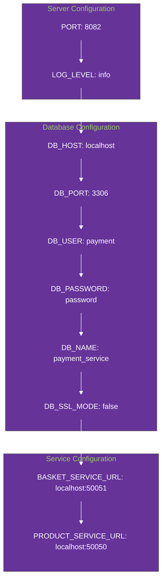

## Event-Driven Architecture with Kafka

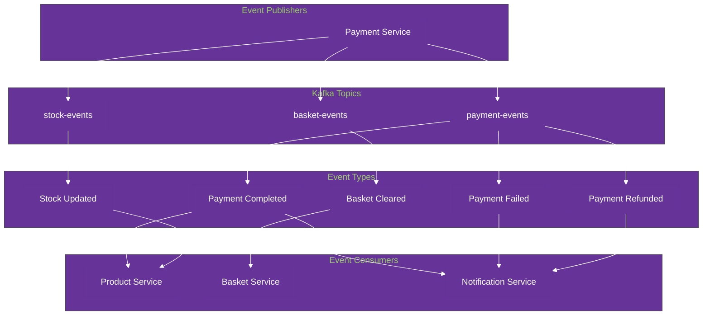

## Docker Services Configuration

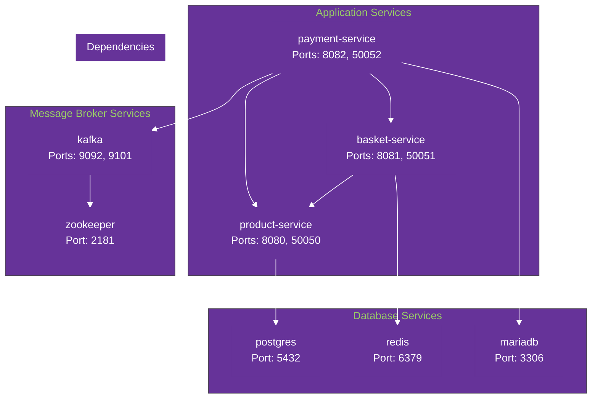

## Technology Stack

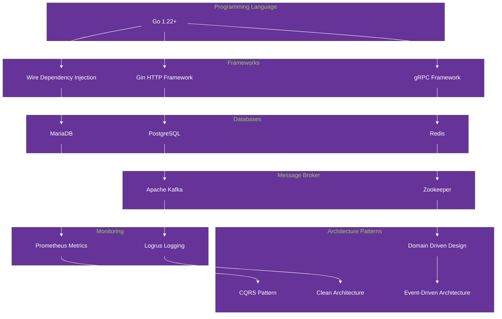

## Development Workflow

```mermaid
%%{init: {'theme':'base', 'themeVariables': { 'primaryColor': '#663399', 'primaryTextColor': '#ffffff', 'primaryBorderColor': '#663399', 'lineColor': '#ffffff', 'secondaryColor': '#663399', 'tertiaryColor': '#663399'}}}%%
graph LR
    subgraph "Setup Phase"
        Setup[make setup]
        InstallDeps[make install-deps]
        Proto[make proto]
    end
    
    subgraph "Development Phase"
        Dev[make dev]
        Build[make build]
        Test[make test]
        Lint[make lint]
    end
    
    subgraph "Deployment Phase"
        DockerBuild[make docker-build]
        DockerRun[make docker-run]
        ServicesStart[make services-start]
    end
    
    subgraph "Maintenance Phase"
        ServicesStop[make services-stop]
        ServicesRestart[make services-restart]
        Clean[make clean]
    end
    
    Setup --> InstallDeps
    InstallDeps --> Proto
    Proto --> Dev
    Dev --> Build
    Build --> Test
    Test --> Lint
    Lint --> DockerBuild
    DockerBuild --> DockerRun
    DockerRun --> ServicesStart
    ServicesStart --> ServicesStop
    ServicesStop --> ServicesRestart
    ServicesRestart --> Clean
```

## Database Schema Overview

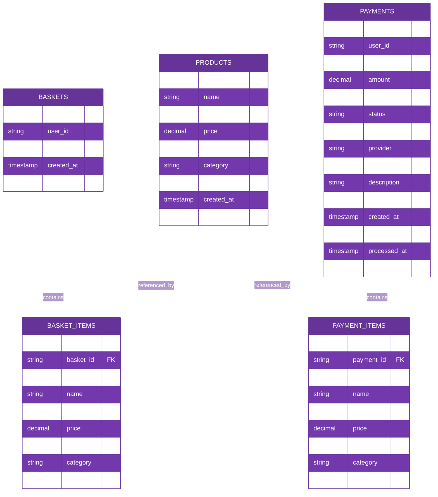

## API Request Flow

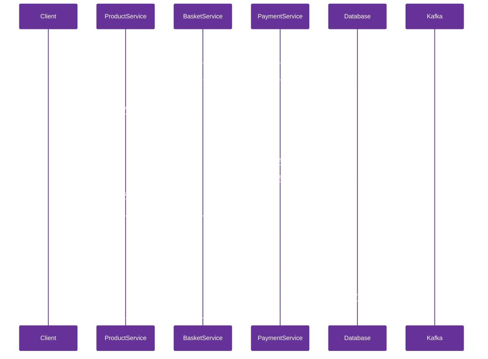

## Service Communication Flow

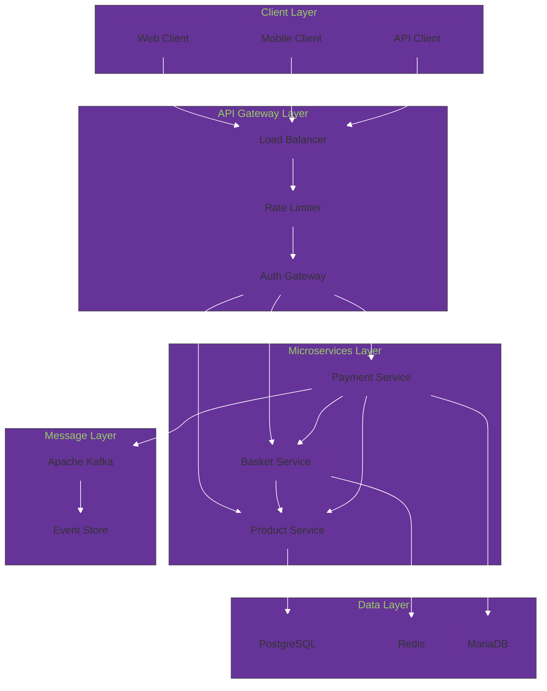