# Microservices Architecture

```mermaid
graph TB
    subgraph "Services"
        Product[🛍️ Product Service<br/>:8080 HTTP<br/>:50050 gRPC]
        Basket[🛒 Basket Service<br/>:8081 HTTP]
    end
    
    subgraph "Data Storage"
        PostgreSQL[(PostgreSQL<br/>:5432)]
        Redis[(Redis<br/>:6379)]
    end
    
    subgraph "Clients"
        HTTPClient[HTTP Client]
        GRPCClient[gRPC Client]
    end
    
    HTTPClient --> Product
    HTTPClient --> Basket
    GRPCClient --> Product
    Basket --> Product
    Product --> PostgreSQL
    Basket --> Redis
```



## 🛍️ Product Service

### Architecture


### API Endpoints

| Method | Endpoint | Description |
|--------|----------|-------------|
| GET | `/products` | Get all products |
| GET | `/products/{id}` | Get product by ID |
| POST | `/products` | Create new product |
| PUT | `/products/{id}` | Update product |
| DELETE | `/products/{id}` | Delete product |
| GET | `/health` | Health check |

### Environment Variables

| Variable | Default | Description |
|----------|---------|-------------|
| `PORT` | `8080` | HTTP server port |
| `GRPC_PORT` | `50050` | gRPC server port |
| `DB_HOST` | `localhost` | PostgreSQL host |
| `DB_PORT` | `5432` | PostgreSQL port |
| `DB_USER` | `postgres` | Database user |
| `DB_PASSWORD` | `password` | Database password |
| `DB_NAME` | `product_service` | Database name |
| `LOG_LEVEL` | `info` | Log level |

## 🛒 Basket Service

### Architecture


### API Endpoints

| Method | Endpoint | Description |
|--------|----------|-------------|
| GET | `/baskets/{user_id}` | Get user's basket |
| POST | `/baskets` | Create new basket |
| POST | `/baskets/{user_id}/items` | Add item to basket |
| PUT | `/baskets/{user_id}/items/{product_id}` | Update item quantity |
| DELETE | `/baskets/{user_id}/items/{product_id}` | Remove item from basket |
| DELETE | `/baskets/{user_id}/items` | Clear all items |
| DELETE | `/baskets/{user_id}` | Delete entire basket |
| GET | `/health` | Health check |

### Environment Variables

| Variable | Default | Description |
|----------|---------|-------------|
| `PORT` | `8081` | HTTP server port |
| `REDIS_HOST` | `localhost` | Redis host |
| `REDIS_PORT` | `6379` | Redis port |
| `REDIS_PASSWORD` | `` | Redis password |
| `REDIS_DB` | `0` | Redis database |
| `PRODUCT_SERVICE_URL` | `localhost:50050` | Product service gRPC URL |
| `LOG_LEVEL` | `info` | Log level |

## 🏗️ Development

### Quick Start
```bash
# Start all services
docker-compose up -d

# Build individual services
go build -o bin/product-service cmd/product/main.go
go build -o bin/basket-service cmd/basket/main.go
```

### Docker Services

| Service | Port | Description |
|---------|------|-------------|
| `product-service` | `8080`, `50050` | Product management service |
| `basket-service` | `8081` | Shopping basket service |
| `postgres` | `5432` | PostgreSQL database |
| `redis` | `6379` | Redis cache |

### Technology Stack

| Component | Technology |
|-----------|------------|
| **Language** | Go 1.21+ |
| **Framework** | Gin (HTTP), gRPC |
| **Database** | PostgreSQL, Redis |
| **DI** | Wire |
| **Monitoring** | Prometheus |
| **Logging** | Logrus |
| **Architecture** | DDD, CQRS, Clean Architecture |